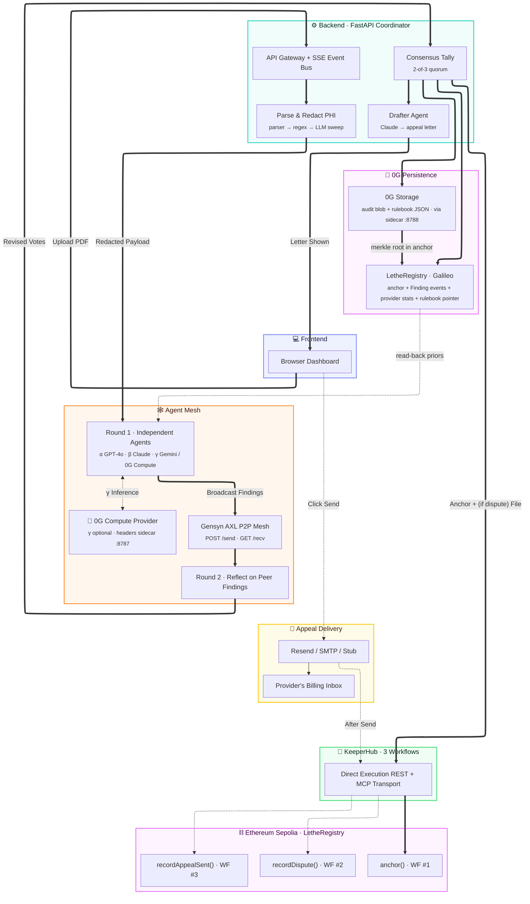
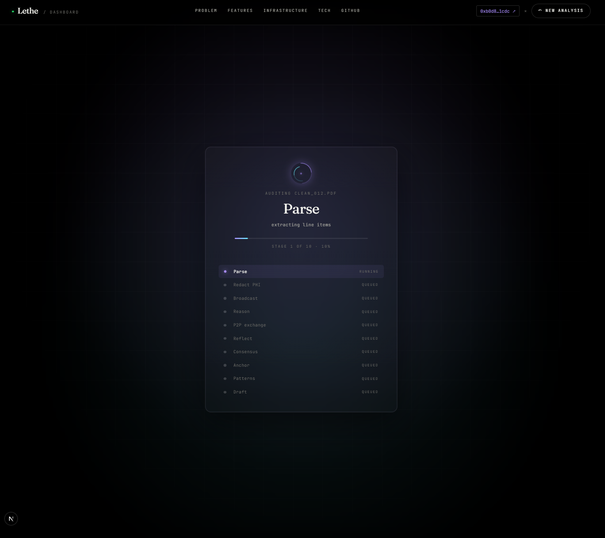
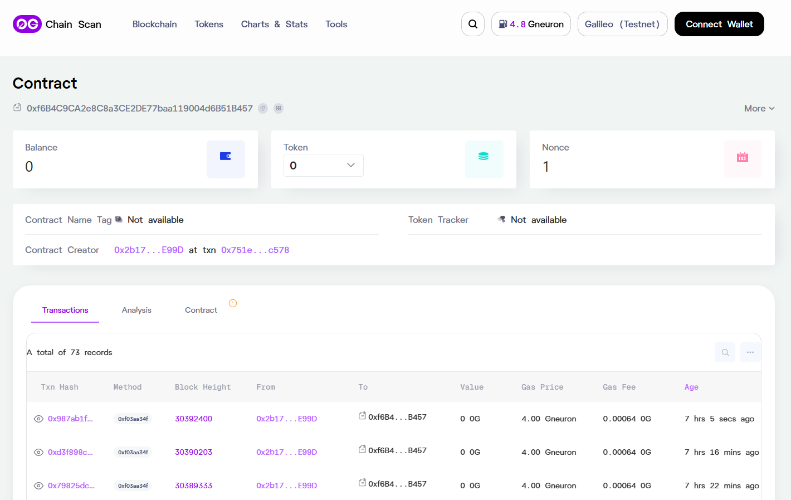
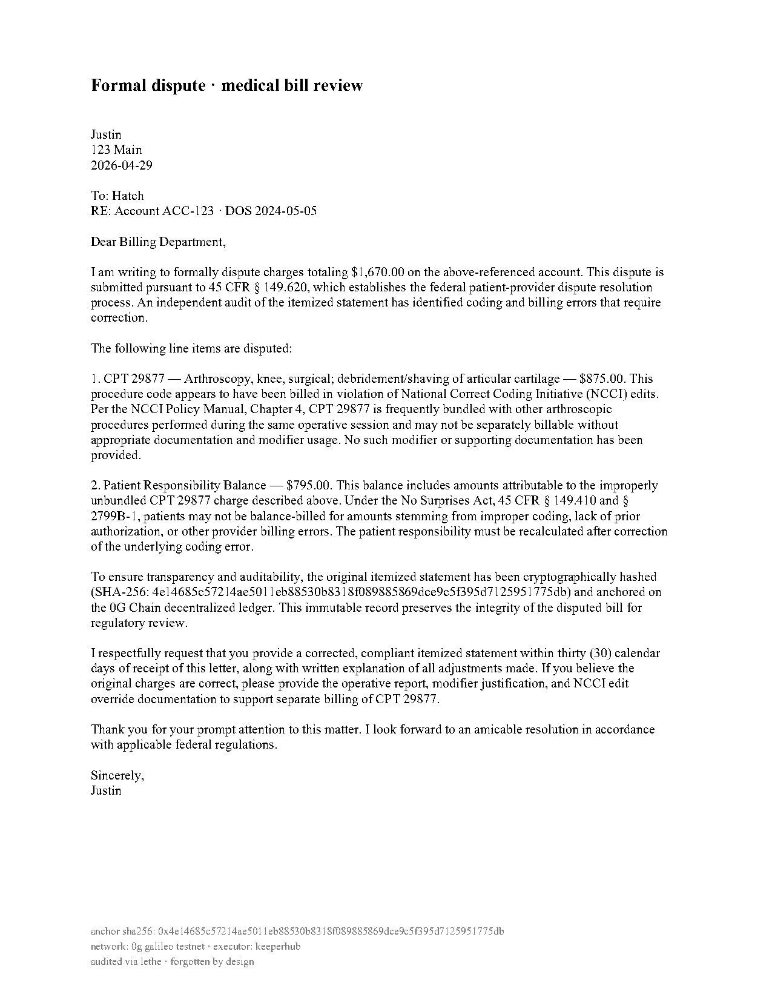

<div align="center">


<h4><sub><i>Lethe</i> &nbsp;·&nbsp; <code>/ˈliː.θi/</code> &nbsp;·&nbsp; LEE-thee &nbsp;·&nbsp; the river of forgetfulness in Greek mythology</sub></h4>

<h3>Catch medical billing errors with AI.<br/>Without ever sharing your personal info.</h3>

<p>
  Drop in your hospital bill. Lethe strips out everything personal — your name, your date of birth, your address — before any AI ever sees it.<br/>
  Three independent AI models check the bill in parallel and have to <i>agree</i> before flagging an error. When they catch a mistake, Lethe drafts the appeal letter for you.<br/>
  The original bill is never saved. Not on a server, not on the blockchain — wiped from memory the moment the audit ends.
</p>

<p>
  <a href="./docs/setup.md"></a>
  <a href="./docs/contracts.md"></a>
  <a href="https://github.com/jhatch3/lethe-"></a>
</p>

<p>
  
  
  
  
  
  
</p>

<br />


</div>

<br />

---

## 📑 Table of contents

- [🩺 The problem](#-the-problem-medical-billing-is-broken)
- [✨ The solution](#-the-solution-three-ais-that-have-to-agree-zero-memory-of-you)
- [🎯 What the software does](#-what-the-software-does)
  - [Features](#features)
  - [Built with](#built-with)
  - [On-chain artifacts](#on-chain-artifacts)
  - [Contract reference](#contract-reference)
  - [Powered by software that's changing what's possible](#powered-by-software-thats-changing-whats-possible)
- [🎬 Demo](#-demo)
- [📁 Repository structure](#-repository-structure)
- [👥 Team](#-team)
- [🙏 Acknowledgments](#-acknowledgments)
- [📄 License](#-license)

> Setup, env vars, and verification: **[setup.md](./docs/setup.md)**.

---

## 🩺 The problem: medical billing is broken

Picture this. You go in for a routine procedure. Weeks later, a bill shows up for $4,000. You can't read the codes. You can't tell what's wrong. You don't have hours to fight it. So you pay.

That's the reality for millions of Americans every year — and it's not a small problem. It's a quiet, nationwide tax on people who are already sick.

### A $125 billion mistake, every single year

| | |
|---|---|
| **$125B** | U.S. losses from medical billing errors annually ([HealthSureHub](https://healthsurehub.com/medical-billing-error-statistics/?utm_source=chatgpt.com)) |
| **49–80%** | of itemized hospital bills contain at least one error — almost always in the patient's disfavor ([HealthSureHub](https://healthsurehub.com/medical-billing-error-statistics/?utm_source=chatgpt.com)) |
| **$31B+** | improper Medicare and Medicaid payments per year ([CMS](https://www.cms.gov/newsroom/fact-sheets/fiscal-year-2024-improper-payments-fact-sheet?utm_source=chatgpt.com)) |
| **38%** | of people who *do* dispute a bill get charges reduced or eliminated ([AJMC](https://www.ajmc.com/view/survey-exposes-pervasive-billing-errors-aggressive-tactics-in-us-health-insurance?utm_source=chatgpt.com)) |
| **23%** | of people don't even try because the process takes too much time ([AJMC](https://www.ajmc.com/view/survey-exposes-pervasive-billing-errors-aggressive-tactics-in-us-health-insurance?utm_source=chatgpt.com)) |
| **~50%** | of denied claims are never resubmitted because the friction is too high ([PCG Software](https://www.pcgsoftware.com/financial-impact-of-medical-billing-errors?utm_source=chatgpt.com)) |

So you have a system that overcharges most patients, makes disputing nearly impossible, and the few tools built to help? They upload your most private medical records to their servers and keep them forever. That's the *opposite* of what someone holding a sensitive bill wants.

**That's the gap Lethe fills.** Catch the errors. Never keep the data.

---

## ✨ The solution: three AIs that have to agree, zero memory of you

Lethe is built on two ideas: **never trust a single AI**, and **never keep the bill**. Here's what happens when you drop in a PDF, in plain English:

1. **Read the bill.** A regular program (not an AI) pulls out the codes, charges, and dates of service.
2. **Strip your identity.** Names, dates of birth, addresses, account numbers — all wiped out *before any AI sees a single byte*.
3. **Three AIs check the work — independently.** GPT-4o, Claude Sonnet 4.5, and Gemini Flash each analyze the redacted bill in parallel. One can optionally run on a *decentralized* AI network instead of a centralized provider, so no single company controls the verdict.
4. **They share findings and re-check.** The agents broadcast what they each found over a peer-to-peer network, then run a second pass with their peers' findings as new context. They're allowed to change their minds.
5. **Two of three or it doesn't count.** A finding only makes the final result if at least 2 of the 3 agents agree on it after that second round. A 1-1-1 split falls back to *clarify* — Lethe never lets registration order silently pick a winner.
6. **Draft the appeal.** A fourth AI writes a formal, citation-bearing dispute letter from the agreed-on errors. You review and download — Lethe never auto-submits anything.
7. **Forget the bill.** The original PDF is wiped from memory. What stays on the blockchain is just a hash + verdict — proof the audit happened, with nothing inside it that could identify you.

When you click **Send appeal**, Lethe emails the letter to the provider and writes a receipt on-chain that the appeal went out. **Three blockchain records per audit:** the verdict, the dispute filing (if there was one), and the appeal-sent attestation. Anyone can verify they happened — nobody can read what was in your bill.

### How it works



> 📐 **Setup, env vars, and verification commands** are in [`docs/setup.md`](./docs/setup.md).

---

## 🎯 What the software does

The technical depth — what's actually running, where, and how it's wired together.

### Features

- **🔒 Zero retention, zero PHI exposure** — bill bytes are zeroed from coordinator memory immediately after parse; agents only ever see the redacted payload.
- **🤖 3-agent independent consensus** — GPT-4o, Claude Sonnet 4.5, Gemini Flash vote in parallel; ≥2-of-3 quorum required, 1-1-1 splits resolve to `clarify`.
- **🔁 Round-2 reflection** — agents broadcast findings, then re-vote with peers' findings as new context. Consensus through conversation, not isolation.
- **🕸️ Real Gensyn AXL P2P mesh** — three Docker sidecars with real ed25519 peer IDs join the public Gensyn mesh; live message log on `/axl` shows every `POST /send` and `GET /recv` with bytes, latency, and verified pubkeys.
- **⛓️ Three pillars on 0G** — Chain (`LetheRegistry`), Storage (full audit blobs + rulebook JSON), Compute (γ optionally on decentralized inference via broker SDK). Stub-fallback at every layer.
- **🧠 Read-back pattern loop** — every new audit scans prior `Finding` events (cached 120s) and feeds dispute/clarify rates per code into the agents' prompts.
- **💚 KeeperHub — three workflows per audit** — anchor mirror, dispute filing (on `dispute`), and appeal-sent attestation (on user click). Same contract, three methods, three gates. REST + MCP transports.
- **✍️ Auto-drafted appeal letter** — a fourth Claude agent writes a citation-bearing letter from the consensus findings; user reviews and downloads, never auto-submitted.
- **🏥 Insurance payer submission** — `POST /api/payer/submit` builds X12 837 / FHIR Claim payloads; 5 pluggable adapters (stub, Stedi, Availity, Change Healthcare, direct FHIR).
- **🩺 On-chain provider reputation** — NPI is salted-SHA-256 hashed and aggregated on `LetheRegistry`; `/providers/<npi>` returns running totals (audits, dispute rate, flagged dollars) read straight from chain.
- **📜 Versioned NCCI rulebook on chain** — rules JSON lives in 0G Storage; per-version manifest hash anchored via `publishRulebook(version, root)`. One tx per bump, no redeploy.
- **👛 Wallet connect + per-wallet audit history** — `/my-audits` lists every bill SHA + verdict + tx the connected wallet ran. Local storage only, never sent to a server.

<details>
<summary><b>Deeper detail on each feature</b> — click to expand</summary>

<br />

#### 🔒 Zero retention, zero PHI exposure
A deterministic parser handles PDFs (with image fallback) inside the coordinator. PHI is then stripped by a regex pass plus an LLM redactor sweep, all *before any audit agent sees the payload*. Bill bytes are zeroed from memory immediately after the parse stage; only the redacted payload travels further. SSE events carry only stage names, verdicts, and counts — no bill content.

#### 🤖 3-agent independent consensus
GPT-4o (α), Claude Sonnet 4.5 (β), and Gemini Flash (γ) each independently analyze the redacted payload — no shared scratchpad, no orchestrator nudge. The verdict is the majority vote; a finding only survives with ≥2-of-3 quorum on the canonical billing code. When no verdict reaches majority (a 1-1-1 split), the system falls back to **clarify** rather than letting registration order silently pick a winner. Confidence is the mean across the winning side.

#### 🔁 Round-2 reflection — consensus through conversation
The three agents don't just vote in isolation — they **talk**. Round 1 runs independent LLM calls in parallel. AXL exchange broadcasts each agent's findings to peers via its sidecar. Round 2 runs a *second* LLM call per agent with peers' findings injected — agents add findings they missed, downgrade ones peers convinced them were wrong, or hold their ground. The dashboard streams a one-line summary per agent: `α: approve → dispute · findings 1→3 · conf 0.92`. Consensus runs on round-2 votes — every finding survived peer scrutiny *and* a 2-of-3 majority.

#### 🕸️ Real Gensyn AXL P2P mesh + live message log
Each of the three agents has its own AXL sidecar Docker container running the upstream Gensyn `node` binary with a unique ed25519 peer ID, joined to the public Gensyn mesh via two TLS bootstrap peers. Real `POST /send` broadcasts and real `GET /recv` inbox drains carry findings across the Yggdrasil overlay. The `/axl` page shows live topology with verified peer keys *plus a live message log* — every send/recv with sender/receiver pubkeys, byte counts, latency, and verified-ok badge. If AXL ever falls back to in-process `asyncio.gather`, a loud uvicorn startup banner makes it impossible to miss.

#### ⛓️ Three pillars on 0G — Chain + Storage + Compute
Every audit hits the full 0G stack: **0G Chain** anchors the SHA-256 + verdict to `LetheRegistry` (Galileo, chain 16602) and emits `Finding` events for the priors loop. **0G Storage** holds the full schema-versioned audit blob (more detail than chain bytes32 fields can carry), with merkle root + commitment tx in the receipt. **0G Compute** *(optional)* runs agent γ on decentralized inference via the broker SDK, with per-request signed headers handled transparently by a local Node sidecar. Built-in stub-fallback at every layer.

#### 🧠 Read-back pattern loop
Before each new audit, the coordinator scans `LetheRegistry`'s `Finding` events via `eth_getLogs` (cached 120s) and formats prior dispute / clarify rates per code into the agents' system prompts. The next run's reasoning shifts based on what previous runs found. A pre-seed script bootstraps ~20 historical findings so the very first demo audit shows real on-chain priors firing.

#### 💚 KeeperHub — three distinct workflows
Every audit fires KH **twice** (mirror anchor + dispute filing on `dispute`) and a **third** time when the user clicks "Send appeal" (appeal-sent attestation). Different methods, different gates — KH is doing real workflow orchestration. Both REST and MCP transports implemented; "already anchored" duplicates are detected and the receipt links the original tx via Sepolia event lookup, not "pending".

#### ✍️ Auto-drafted appeal letter
A fourth agent (Claude, separately prompted) takes the consensus findings and writes a formal, citation-bearing appeal letter. The dashboard renders it as an ASCII-bordered receipt PDF you can review and download — Lethe never auto-submits anything to an insurer.

#### 🏥 Insurance payer submission
Once consensus lands on `dispute`, a panel on the dashboard lets the patient file the same disputed-codes packet directly with the insurance payer or clearinghouse. `POST /api/payer/submit` builds an X12 837 / FHIR Claim payload from the consensus findings + member info and dispatches through a pluggable adapter table. Five adapters are registered today: **stub** (default — generates a deterministic mock claim id and returns success, so the full flow is demoable end-to-end without sandbox creds), **stedi** (X12 837 over Stedi REST), **availity** (Availity FHIR R4 + Web Services), **change healthcare** (clearinghouse SOAP/REST), and **fhir** (direct payer FHIR endpoint). The adapter is selected by `LETHE_PAYER_ADAPTER` and the dashboard surfaces `live submission` vs `stub mode` in the response. Member ID, plan ID, and DOB are passed through to the adapter and never persisted.

#### 🩺 On-chain provider reputation
Each audit's NPI is extracted from the bill, salted-SHA-256 hashed, and rolled up atomically inside `LetheRegistry.anchor()`. Anyone can hit `/providers/<npi>` to see that provider's running stats — total audits, dispute rate, total flagged dollars — read directly from chain. The aggregate is keyed by NPI hash so individual bills aren't linkable, but a provider's overall pattern is. The page also links straight to the chainscan address so the count is independently verifiable.

#### 📜 Versioned NCCI rulebook on chain
Coding rules (CPT bundling pairs, modifier-required pairings, units-per-day caps, time-overlap conflicts) live as a JSON manifest in **0G Storage**; the per-version manifest hash is anchored on-chain via `LetheRegistry.publishRulebook(version, manifestRoot)`. Bumping a version is one tx, no contract redeploy. The `/rules` page reads the manifest pointer from chain and pulls the JSON via the storage sidecar. Every audit ties to a specific `rulebookVersion` written into its anchor record.

#### 👛 Wallet connect + per-wallet audit history
Connect MetaMask (or any EIP-1193 wallet) and the dashboard remembers the audits you ran. `/my-audits` lists every bill SHA, verdict, and chain tx the connected wallet has produced — pulled from local storage, scoped per wallet address, never sent to a server. Switch wallets and the list rescopes. The wallet itself isn't required to run an audit; it's strictly an opt-in personal index so you can find your prior receipts later.

</details>

### Built with

<div align="center">

<table>
<tr>
<td align="center" width="16%"><br/><sub><b>Next.js 16</b></sub></td>
<td align="center" width="16%"><br/><sub><b>React 19</b></sub></td>
<td align="center" width="16%"><br/><sub><b>TypeScript</b></sub></td>
<td align="center" width="16%"><br/><sub><b>Tailwind v4</b></sub></td>
<td align="center" width="16%"><br/><sub><b>Framer Motion</b></sub></td>
<td align="center" width="16%"><br/><sub><b>jsPDF</b></sub></td>
</tr>
<tr>
<td align="center"><br/><sub><b>Python 3.11</b></sub></td>
<td align="center"><br/><sub><b>FastAPI</b></sub></td>
<td align="center"><br/><sub><b>pdfplumber</b></sub></td>
<td align="center"><br/><sub><b>httpx</b></sub></td>
<td align="center"><br/><sub><b>Docker Compose</b></sub></td>
<td align="center"><br/><sub><b>GitHub</b></sub></td>
</tr>
<tr>
<td align="center"><br/><sub><b>Solidity</b></sub></td>
<td align="center"><br/><sub><b>web3.py</b></sub></td>
<td align="center"><br/><sub><b>GPT-4o</b></sub></td>
<td align="center"><br/><sub><b>Claude</b></sub></td>
<td align="center"><br/><sub><b>Gemini</b></sub></td>
<td align="center"><br/><sub><b>Gensyn AXL (Go)</b></sub></td>
</tr>
<tr>
<td align="center"><br/><sub><b>0G Chain</b></sub></td>
<td align="center"><br/><sub><b>0G Storage<br/><sup>@0glabs/0g-ts-sdk</sup></b></sub></td>
<td align="center"><br/><sub><b>0G Compute<br/><sup>@0glabs/0g-serving-broker</sup></b></sub></td>
<td align="center"><br/><sub><b>KeeperHub<br/><sup>REST + MCP</sup></b></sub></td>
<td align="center"><br/><sub><b>mcp (Python)</b></sub></td>
<td align="center"><br/><sub><b>Node sidecars<br/><sup>tsx + ethers v6</sup></b></sub></td>
</tr>
</table>

<sub>Frontend · Coordinator · Chain & AI · 0G stack · Cross-chain execution</sub>

</div>

### On-chain artifacts

One contract per chain — `LetheRegistry` consolidates the anchor, finding events, dispute filings, appeal-sent attestations, provider stats, and rulebook manifest pointer onto a single deployed address. KeeperHub fires three workflows that hit three different methods on the Sepolia instance.

| Contract | Network | Address | Status | Explorer |
|----------|---------|---------|--------|----------|
| `LetheRegistry` (canonical) | 0G Galileo testnet (chain id 16602) | _pending wallet funding_ | ⏳ deploy queued | — |
| `LetheRegistry` (Sepolia mirror · 3 KH workflows) | Ethereum Sepolia (chain id 11155111) | `0x93D691801FE81Fe3aC7187fe1F394f40a045973E` | ✅ deployed | [sepolia.etherscan.io](https://sepolia.etherscan.io/address/0x93D691801FE81Fe3aC7187fe1F394f40a045973E) |

The full anonymized audit record is uploaded to **0G Storage** with a merkle root + commitment tx, and the merkle root is recorded as a field on `LetheRegistry.anchor()` so future audits scan `BillAnchored` events for recent roots and pull blobs back via the storage sidecar's `GET /download` endpoint — agents read priors that are strictly richer than the bytes32-truncated chain events. The NCCI rulebook lives in 0G Storage too; only the per-version manifest hash is anchored on-chain via `LetheRegistry.publishRulebook`.

Solidity source: [`LetheRegistry.sol`](./src/contracts/src/LetheRegistry.sol). Deploy script (`py-solc-x` + `web3.py`, no Foundry): [`src/contracts/deploy.py`](./src/contracts/deploy.py).

### Contract reference

Full ABI — every method, every event, with inputs, outputs, gates, and runnable web3.py examples — lives in [`docs/contracts.md`](./docs/contracts.md).

At a glance:

| Surface | Methods |
|---|---|
| **Write** | `anchor` · `indexFindings` · `recordDispute` · `recordAppealSent` · `publishRulebook` (owner) · `transferOwnership` (owner) |
| **Read** | `anchors` · `isAnchored` · `providerStats` · `disputeRateBps` · `rulebookManifest` · `currentRulebookVersion` · `owner` |
| **Events** | `BillAnchored` · `Finding` · `DisputeFiled` · `AppealSent` · `RulebookPublished` · `OwnerTransferred` |

#### Events

Queryable via `eth_getLogs`. Indexed topics (marked `[i]`) are filterable directly in `topics[]`.

| Event | Fields | Indexed | When it fires | Why you'd query it |
|---|---|---|---|---|
| `BillAnchored` | `billHash` · `npiHash` · `verdict` · `agreeCount` · `totalAgents` · `storageRoot` · `rulebookVersion` · `flaggedCents` · `anchoredAt` · `anchoredBy` | `[i] billHash`, `[i] npiHash`, `[i] anchoredBy` | every `anchor()` call | "all audits for this bill" / "all audits this wallet anchored" / "all audits for this provider" |
| `Finding` | `billHash` · `code` · `action` · `severity` · `amountCents` · `voters` · `indexedBy` · `indexedAt` | `[i] billHash`, `[i] code`, `[i] indexedBy` | once per finding inside `indexFindings()` | "all findings for code CPT 99214" — drives the priors loop |
| `DisputeFiled` | `billHash` · `reason` · `note` · `filedAt` · `filedBy` | `[i] billHash`, `[i] filedBy` | every `recordDispute()` | "show me every dispute filing for this bill" |
| `AppealSent` | `billHash` · `recipientHash` · `sentAt` · `sentBy` | `[i] billHash`, `[i] recipientHash`, `[i] sentBy` | every `recordAppealSent()` | "did this bill ever get an appeal sent?" |
| `RulebookPublished` | `version` · `manifestRoot` · `publishedAt` · `publishedBy` | `[i] version`, `[i] publishedBy` | every `publishRulebook()` | rulebook history / audit trail of rule changes |
| `OwnerTransferred` | `from` · `to` | `[i] from`, `[i] to` | rare | governance transfer history |

If you don't want to write web3 code, the coordinator exposes `GET /api/verify/<sha>`, `GET /api/providers/<npi>`, and `GET /api/rules` as JSON wrappers over the read paths.

#### Two deployments, one source

Both chains run the **same** [`LetheRegistry.sol`](./src/contracts/src/LetheRegistry.sol) source — identical ABI, struct layout, events, and gates. What differs is **who calls which methods, on which chain, and why**.

| Method | 0G Galileo (canonical) | Sepolia (mirror via KeeperHub) |
|---|---|---|
| `anchor()` | ✅ every audit · coordinator wallet | ✅ every audit · KH workflow #1 |
| `indexFindings()` | ✅ every audit — drives the priors loop | ❌ never called |
| `recordDispute()` | ❌ never called | ✅ on `dispute` verdicts · KH workflow #2 |
| `recordAppealSent()` | ❌ never called | ✅ on user "Send appeal" click · KH workflow #3 |
| `publishRulebook()` | ✅ owner, on NCCI version bump | ❌ no rulebook-driven audits run from Sepolia |
| Reads from chain | `Finding` events for priors, `anchors()` for verify | Mostly attestation — no read-back loop |
| `storageRoot` field | Real merkle root pointing into 0G Storage | Same root mirrored (or zero — pointer still resolves against 0G Storage either way) |

**Why the asymmetry:** Galileo is where the swarm thinks — `Finding` events feed prompts, the rulebook lives in 0G Storage, agent γ runs on 0G Compute. Sepolia is where KeeperHub proves to the wider Ethereum ecosystem that the audit happened: three workflows, three methods, one immutable ledger entry per real-world action.

### Powered by software that's changing what's possible

Lethe couldn't have been built five years ago. The pieces it depends on — distributed AI compute, peer-to-peer agent meshes, cross-chain workflow execution — were research papers, not production systems. **Three sponsor companies took those ideas and shipped them**, and each one is making a category of software possible that used to require trusting a single corporation.

> Submitted to all three sponsor tracks at [ETHGlobal OpenAgents](https://ethglobal.com/events/openagents). Each one maps to a load-bearing piece of the system, with verifiable on-chain or open-source artifacts.

#### 🎖️ Gensyn — letting AI agents talk to each other directly

**Why this matters for the world.** Most "multi-agent AI" today is one server orchestrating a few model calls in a loop. That's not really agents collaborating — it's one program calling APIs. **Gensyn AXL** is a peer-to-peer network where independent agents can find each other and exchange messages directly, with cryptographic identities and end-to-end encryption. That unlocks AI consensus the way it should work: agents on different nodes, run by different operators, sharing findings without a single party in the middle. For sensitive use cases like healthcare, legal, or finance — where you can't have one company silently controlling the verdict — that's a genuine breakthrough.

**How Lethe uses AXL.** Each of the three audit agents has its own AXL sidecar Docker container running the upstream Gensyn `node` binary with a unique ed25519 keypair, joined to the public Gensyn mesh via two TLS bootstrap peers. Agents exchange findings between rounds via real `POST /send` broadcasts and `GET /recv` inbox drains — the round-2 reflection LLM call literally cannot fire without findings arriving across the mesh. The frontend `/axl` page renders **live topology** plus a 200-entry message log (every send/recv with bytes, latency, and signed pubkey pair).

**Cross-node communication proof:**
- Three separate Docker services in [`docker-compose.yml`](./docker-compose.yml) — `axl-alpha`, `axl-beta`, `axl-gamma`
- Three real ed25519 peer IDs in [`infra/axl/keys/peer_ids.json`](./infra/axl/keys/peer_ids.json) (raw 32-byte ed25519 pubkeys derived from PKCS#8 keys, not fabricated strings)
- Live verification at `/axl` shows each sidecar's `/topology` response with verified pubkeys and connections to public Gensyn peers
- No central message broker — `POST /send` from agent X's sidecar to agent Y's sidecar over the encrypted Yggdrasil overlay

**Code:** [`agents/transport_axl.py`](./src/coordinator/agents/transport_axl.py) (HTTP client + 200-entry message ring buffer), [`pipeline/runner.py`](./src/coordinator/pipeline/runner.py) (`_exchange()` and `_reflect_all()` stages), [`infra/axl/`](./infra/axl/) (Dockerfile + per-peer configs).

#### 🛠️ 0G — making decentralized AI infrastructure actually usable

**Why this matters for the world.** A lot of "decentralized AI" is marketing. **0G** is the rare project that built the three primitives needed to run real AI applications without trusting a single provider: a high-throughput chain for verifiable records, a storage layer for model weights and large blobs, and a compute network for distributed inference. When an AI judges your medical bill — or your loan application, or a court filing — it shouldn't be possible for a single company to silently swap the model out from under you. 0G is the infrastructure that lets that promise actually be kept: every verdict anchored on a public chain, every rulebook stored as a versioned manifest anyone can audit, and the inference itself running on a network instead of a closed API.

**How Lethe uses 0G — three pillars:** Lethe is a 3-agent swarm (GPT-4o · Claude · Gemini) that uses **the entire 0G stack**:

- **0G Chain.** `LetheRegistry` is one contract that owns the full audit surface — anchor record (SHA-256, verdict, NPI hash, storage root, rulebook version), `Finding` events for each consensus finding, aggregate provider stats updated atomically inside `anchor()`, and the rulebook manifest pointer. The coordinator reads `Finding` events back via `eth_getLogs` (cached 120s) and feeds aggregate dispute/clarify rates into agent prompts as priors. **Each new audit gets smarter via on-chain shared memory — and there's exactly one address to verify.**
- **0G Storage — bidirectional.** Every audit's full anonymized record is uploaded as a JSON blob via `@0glabs/0g-ts-sdk` (through a local Node sidecar) — returns a merkle root + on-chain commitment tx. The `(billHash → storageRoot)` pointer is *also* written to a deployed `StorageIndex` contract on Galileo, so future audits query `eth_getLogs` for recent roots and pull blobs back via the sidecar's `GET /download?root=R` endpoint. **The agents read priors from Storage** when blobs are available (full code strings + voter agent names) — strictly richer than the `bytes32`-truncated `PatternRegistry` events. Storage isn't cold archive; it's the primary memory layer.
- **0G Compute.** Agent γ can run on a **decentralized inference node** instead of Google Gemini. The coordinator routes through a Node sidecar that signs each request body hash via the broker SDK — 0G Compute auth is per-request, not a static bearer token. The factory probes the sidecar at startup and silently falls back to Gemini if unreachable, so `/api/status` always honestly reports γ's actual provider.

**Swarm coordination:**
- Three independent LLM agents reason in parallel during round 1 (different SDKs, different keys, different system prompts).
- Findings broadcast over Gensyn AXL (see Track 1).
- Round-2 reflection per agent with peer findings as context — agents may revise verdict, add findings, downgrade contested ones.
- 2-of-3 quorum on canonical billing code; 1-1-1 splits resolve to "clarify" (no silent registration-order tiebreak).

**Code:** [`chain/zerog.py`](./src/coordinator/chain/zerog.py) (anchor writes), [`chain/zerog_storage.py`](./src/coordinator/chain/zerog_storage.py) (PatternRegistry indexer), [`chain/zerog_blob.py`](./src/coordinator/chain/zerog_blob.py) (0G Storage uploader · 4 KB padding · circuit breaker), [`chain/storage_priors.py`](./src/coordinator/chain/storage_priors.py) (StorageIndex pointer write + read-back loop), [`chain/patterns.py`](./src/coordinator/chain/patterns.py) (chain-event priors fallback), [`agents/audit_0g.py`](./src/coordinator/agents/audit_0g.py) (γ on 0G Compute), [`agents/audit_google.py`](./src/coordinator/agents/audit_google.py) (γ factory · auto-fallback to Gemini), [`scripts/storage_sidecar.ts`](./src/coordinator/scripts/storage_sidecar.ts) and [`scripts/headers_sidecar.ts`](./src/coordinator/scripts/headers_sidecar.ts) (Node bridges to 0G TS SDKs).

#### 💚 KeeperHub — turning agreements into automatic, verifiable actions

**Why this matters for the world.** The hardest part of any blockchain product isn't writing the smart contract. It's getting the right thing to happen at the right time, across systems that don't trust each other. **KeeperHub** is the workflow layer that handles "when X happens here, fire Y over there" — across chains, off-chain APIs, and time-delayed conditions. An AI consensus is just a thought until something happens because of it: a record gets written, an email goes out, a follow-up fires weeks later. KeeperHub is what turns a software opinion into a verifiable real-world action. For software that's supposed to *advocate* for someone — patients, borrowers, plaintiffs — that follow-through is the whole product.

**How Lethe uses KeeperHub — three distinct workflows.** KeeperHub turns one consensus into multiple chain-verifiable side effects:

All three workflows hit the **same** `LetheRegistry` contract on Sepolia ([`0x93D6…973E`](https://sepolia.etherscan.io/address/0x93D691801FE81Fe3aC7187fe1F394f40a045973E)) — three different methods, three different gates, one address.

1. **Mirror anchor (every audit).** `LetheRegistry.anchor()` via KH Direct Execution `POST /api/execute/contract-call`. Same record as 0G Galileo, written by KH's managed wallet. Already-anchored duplicates are detected and the receipt links the original tx via Sepolia event lookup, not "pending".
2. **Dispute filing (consensus = `dispute`).** A second KH execution fires `LetheRegistry.recordDispute(billHash, reason, note)` with a redacted findings summary. Same contract; different method gated on `verdict == Dispute`.
3. **Appeal-sent attestation (user click).** When the user types a provider email and clicks **Send appeal**, the coordinator emails the appeal letter + chain verification table, then a third KH execution fires `LetheRegistry.recordAppealSent(billHash, recipientHash)`. Recipient address is keccak-hashed before going on-chain.

**Two integration vectors implemented:**
- **Direct Execution REST API** (default for all three workflows)
- **MCP server transport** — `LETHE_KEEPERHUB_USE_MCP=true` switches the mirror anchor through KeeperHub's MCP server using the official `mcp` Python SDK. Falls back to REST if MCP returns a stub. The prize text reads "MCP server or CLI"; this satisfies the strict reading.

**Code:** [`chain/keeperhub.py`](./src/coordinator/chain/keeperhub.py) (REST integration for all three workflows), [`chain/keeperhub_mcp.py`](./src/coordinator/chain/keeperhub_mcp.py) (MCP transport), [`routers/appeal.py`](./src/coordinator/routers/appeal.py) + [`email_delivery/`](./src/coordinator/email_delivery/) (the appeal-send pipeline).

---

## 🎬 Demo

| | |
|---|---|
| 🎥 **Demo video** | [Watch on YouTube →](#) |
| 🌐 **Live demo** | [lethe-demo.vercel.app](#) |
| 📜 **Pitch deck** | [View slides →](#) |
| 📐 **Setup & verification** | [setup.md](./docs/setup.md) |

<div align="center">
  
  <br />
  
  <br />
  
  <br />
  
</div>

---

## 📁 Repository structure

```
lethe-/
├── src/
│   ├── frontend/              # Next.js 16 dashboard (App Router, TS, Tailwind v4)
│   │   └── src/app/{dashboard,axl,patterns,verify,my-audits,providers/[npi],rules,tech-stack}/page.tsx
│   ├── coordinator/           # FastAPI orchestrator
│   │   ├── main.py            # app entry + CORS + sweeper + AXL-off startup banner
│   │   ├── routers/           # jobs · samples · status · verify · appeal · providers · rules · payer · dashboard
│   │   ├── pipeline/          # runner, parser, redactor, consensus, dispute drafter, event bus
│   │   ├── agents/            # audit_{openai,anthropic,google,0g}, drafter, transport_axl, prompts
│   │   ├── chain/             # lethe_registry (unified anchor + findings + provider stats + rulebook pointer)
│   │   │                      # zerog_blob (0G Storage uploads · audit blobs + rulebook JSON)
│   │   │                      # patterns (chain-event priors fallback)
│   │   │                      # keeperhub (REST · 3 workflows on LetheRegistry/Sepolia) · keeperhub_mcp (MCP transport)
│   │   ├── payer/             # X12 837 / FHIR adapter dispatch — stub · stedi · availity · ch · fhir
│   │   ├── email_delivery/    # sender (resend / smtp / stub) + HTML template builder
│   │   ├── scripts/           # Node helpers — provision:0g · headers:0g · storage:0g · check:0g
│   │   ├── samples/           # example bills used by the dashboard chips
│   │   └── store/             # in-memory job store + sweeper, rolling stats
│   └── contracts/             # LetheRegistry — single contract per chain
│                              # deployed via deploy.py (py-solc-x + web3.py, no Foundry)
├── tools/
│   └── dashboard.py           # CLI ASCII TUI — subscribes to /api/events/global SSE, shows tracks live
├── infra/
│   └── axl/                   # Dockerfile, configs/{alpha,beta,gamma}.json, keys/peer_ids.json
├── data-gen/                  # Bill PDF generator + Finding-event pre-seed script
├── docker-compose.yml         # axl-alpha, axl-beta, axl-gamma, coordinator, frontend
├── docs/                      # setup.md · contracts.md · roadmap.md · draft-writeup.md · assets/
└── README.md
```

---

## 👥 Team

<table>
<tr>
<td align="center" width="33%">
  <br />
  <b>Justin Hatch</b><br />
  <a href="https://github.com/Justyhatch3">GitHub</a> · <a href="https://www.linkedin.com/in/justinhatch/">LinkedIn</a><br />
  <sub>Telegram <code>@jjhatch033</code> · X <code>@jjhatch11</code></sub>
</td>
<td align="center" width="33%">
  <br />
  <b>Drew Manley</b><br />
  <a href="https://github.com/drewmanley16">GitHub</a> · <a href="https://www.linkedin.com/in/drewmanley/">LinkedIn</a><br />
  <sub>Telegram <code></code> · X <code></code></sub>
</td>
<td align="center" width="33%">
  <br />
  <b>Cameron Coleman</b><br />
  <a href="https://github.com/camcoleman">GitHub</a> · <a href="https://www.linkedin.com/in/camcoleman/">LinkedIn</a><br />
  <sub>Telegram <code>@cameroncoleman13</code> · X <code>@cam_coleman1</code></sub>
</td>
</tr>
</table>


---

## 🙏 Acknowledgments

<table>
<tr>
<td valign="middle" width="20%" align="center" bgcolor="#ffffff">
  <a href="https://www.oregonblockchain.org">
    
  </a>
</td>
<td valign="middle">

### [Oregon Blockchain Group](https://www.oregonblockchain.org)

Built with support from the **Oregon Blockchain Group** at the University of Oregon, a student-led organization at the heart of the Pacific Northwest blockchain ecosystem and part of the [University Blockchain Research Initiative](https://ripple.com/impact/ubri/).

[Website](https://www.oregonblockchain.org) · [LinkedIn](https://www.linkedin.com/company/oregonblockchain) · [Twitter](https://x.com/oregonblock) · [Instagram](https://www.instagram.com/oregonblockchaingroup/)

</td>
</tr>
</table>

Special thanks to the sponsors of the ETHGlobal OpenAgents tracks: [0G Labs](https://0g.ai), [Gensyn](https://www.gensyn.ai), and [KeeperHub](https://keeperhub.com), for the infrastructure that makes Lethe possible.

---

## 📄 License

[MIT](./LICENSE) © 2026. Built at [ETHGlobal OpenAgents](https://ethglobal.com/events/openagents)

<br />

<div align="center">

<sub>Lethe is a hackathon project and is not yet a production medical service.<br/>
Disputes drafted by Lethe should be reviewed by a human before submission to a real insurer.</sub>

<br /><br />

<a href="#-the-problem-medical-billing-is-broken"><b>↑ Back to top ↑</b></a>

</div>
