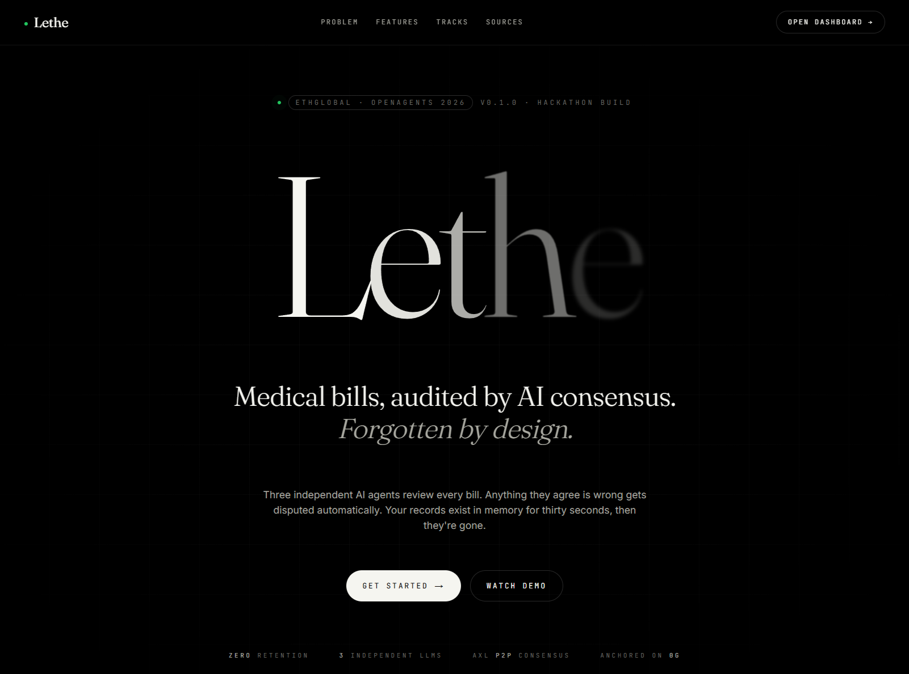
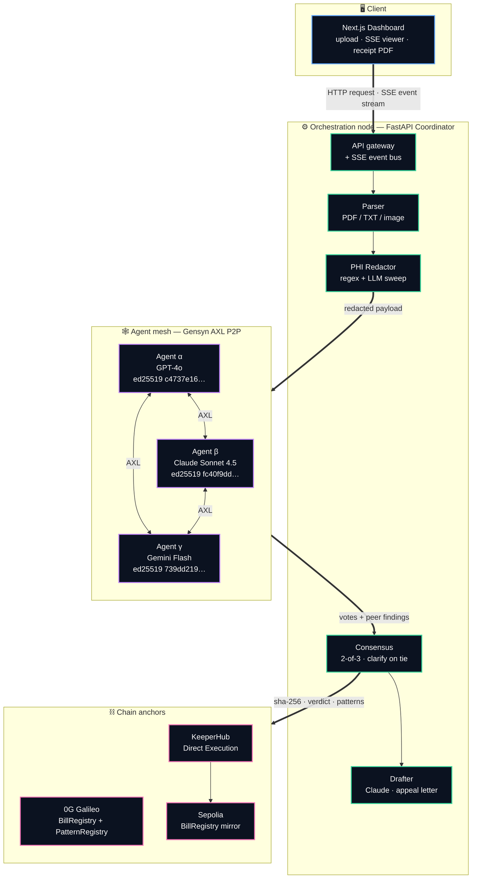

<div align="center">


<h3>Medical bills, audited by AI consensus.<br/>Forgotten by design.</h3>

<p>
  Your bill is parsed and redacted locally. The AI never sees your PHI.<br/>
  Three independent agents vote on the redacted payload over a real Gensyn AXL mesh. Anything they agree is wrong is drafted into an appeal.<br/>
  The original bill is held in coordinator memory only — never written to disk, never persisted on-chain.
</p>

<p>
  <a href="./SETUP.md"></a>
  <a href="https://ethglobal.com/events/openagents"></a>
</p>

<p>
  
  
  
  
  
</p>

<br />



</div>

<br />

---

## 🩺 The problem

<table>
<tr>
<td width="33%" valign="top">

### 80% of bills overcharge
Surveys consistently find that the majority of itemized hospital bills contain at least one error in the patient's disfavor: duplicated codes, wrong modifiers, services that never happened.

</td>
<td width="33%" valign="top">

### Disputing is brutal
The standard process means hours on the phone, navigating insurer portals, drafting appeal letters, and waiting weeks for a response. Most patients never start.

</td>
<td width="33%" valign="top">

### The few tools that exist store everything
Existing services upload your records to a central database and keep them indefinitely. That's the opposite of what a HIPAA-anxious patient wants.

</td>
</tr>
</table>

---

## ✨ What Lethe does

Drop in a medical bill. A deterministic PDF parser extracts the structured data (CPT/ICD codes, modifiers, charges, dates of service) and a redaction pass strips every piece of PHI (patient name, DOB, address, MRN, account numbers) — *before any AI ever sees the payload*. Three independent AI agents (GPT-4o, Claude Sonnet, Gemini Flash) — each broadcasting the redacted payload to two real ed25519 peers over a [Gensyn AXL](https://blog.gensyn.ai/introducing-axl/) mesh joined to the public Gensyn network — analyze the bill in parallel. They vote. A finding only enters the final result if at least 2 of 3 agents flag it. A fourth agent (Claude) drafts a formal appeal letter from the agreed-on findings.

The original bill never touches storage and never reaches a model provider. It lives in coordinator memory long enough for the parser and redactor to run, then it's discarded. What persists is a SHA-256 hash anchored on [0G Chain](https://0g.ai) (proof of *what was analyzed*), the same hash mirrored to a Sepolia `BillRegistry` via [KeeperHub](https://keeperhub.com), and an anonymized pattern record on a 0G `PatternRegistry` that makes the next user's analysis smarter without anyone's records being recoverable.

---

## 🏗️ Architecture



> 📐 **Setup, env vars, and verification commands** are in [`SETUP.md`](./SETUP.md).

---

## 🎯 Features (as of April 26, 2026)

<table>
<tr>
<td width="50%" valign="top">

### 🔒 Zero retention, zero PHI exposure
A deterministic parser handles PDFs (with image fallback) inside the coordinator. PHI is then stripped by a regex pass plus an LLM redactor sweep, all *before any audit agent sees the payload*. Bill bytes are zeroed from memory immediately after the parse stage; only the redacted payload travels further. SSE events carry only stage names, verdicts, and counts — no bill content.

</td>
<td width="50%" valign="top">

### 🤖 3-agent LLM consensus
GPT-4o (α), Claude Sonnet 4.5 (β), and Gemini Flash (γ) each independently analyze the redacted payload. The verdict is the majority vote; a finding only survives with ≥2-of-3 quorum on the canonical billing code. When no verdict reaches majority (a 1-1-1 split), the system honestly falls back to **clarify** rather than letting registration order silently pick a winner. Confidence is the mean across the winning side.

</td>
</tr>
<tr>
<td width="50%" valign="top">

### 🕸️ Real Gensyn AXL P2P transport
Each of the three agents has its own AXL sidecar Docker container running the upstream Gensyn `node` binary with a unique ed25519 peer ID. After reasoning, each agent **broadcasts its own findings** to its peers via real `POST /send` calls; every sidecar's inbox is then drained with `GET /recv` so peers literally receive each other's analyses across the mesh. Each vote records the `peer_received` payloads it actually saw, so the P2P exchange is load-bearing — not symbolic. The `/axl` page shows live topology with verified peer keys; during a run the dashboard streams both broadcast and receipt events into each agent's terminal.

</td>
<td width="50%" valign="top">

### ⛓️ Dual-chain anchor + on-chain priors
Every audit anchors the bill SHA-256 + verdict to a `BillRegistry` on the 0G Galileo testnet (canonical) and mirrors the same record to a Sepolia `BillRegistry` via KeeperHub Direct Execution. Anonymized findings are written to a `PatternRegistry` on 0G — and read back on the next run as priors, so the system literally learns from itself.

</td>
</tr>
<tr>
<td width="50%" valign="top">

### 🧠 Read-back pattern loop
Before each new audit, the coordinator queries `eth_getLogs` on the `PatternRegistry` and formats prior dispute / clarify rates per code into the agents' system prompts. The next run's reasoning shifts based on what previous runs found.

</td>
<td width="50%" valign="top">

### ✍️ Auto-drafted appeal letter
A fourth agent (Claude, separately prompted) takes the consensus findings and writes a formal, citation-bearing appeal letter. The dashboard renders it as an ASCII-bordered receipt PDF you can review and download — Lethe never auto-submits anything to an insurer.

</td>
</tr>
</table>

---

## 🛠️ Built with

<div align="center">

<table>
<tr>
<td align="center" width="16%"><br/><sub><b>Next.js 16</b></sub></td>
<td align="center" width="16%"><br/><sub><b>React 19</b></sub></td>
<td align="center" width="16%"><br/><sub><b>TypeScript</b></sub></td>
<td align="center" width="16%"><br/><sub><b>Tailwind v4</b></sub></td>
<td align="center" width="16%"><br/><sub><b>Framer Motion</b></sub></td>
<td align="center" width="16%"><br/><sub><b>jsPDF</b></sub></td>
</tr>
<tr>
<td align="center"><br/><sub><b>Python 3.11</b></sub></td>
<td align="center"><br/><sub><b>FastAPI</b></sub></td>
<td align="center"><br/><sub><b>pdfplumber</b></sub></td>
<td align="center"><br/><sub><b>httpx</b></sub></td>
<td align="center"><br/><sub><b>Docker Compose</b></sub></td>
<td align="center"><br/><sub><b>GitHub</b></sub></td>
</tr>
<tr>
<td align="center"><br/><sub><b>Solidity</b></sub></td>
<td align="center"><br/><sub><b>web3.py</b></sub></td>
<td align="center"><br/><sub><b>GPT-4o</b></sub></td>
<td align="center"><br/><sub><b>Claude</b></sub></td>
<td align="center"><br/><sub><b>Gemini</b></sub></td>
<td align="center"><br/><sub><b>Gensyn AXL (Go)</b></sub></td>
</tr>
</table>

<sub>Frontend · Coordinator · Chain & AI</sub>

</div>

---

## 🏆 Hackathon tracks

Built for [ETHGlobal OpenAgents](https://ethglobal.com/events/openagents), April 24 – May 3, 2026.

<table>
<tr>
<td width="33%" valign="top" align="center">

### [0G](https://0g.ai)
**The blockchain for AI agents**

Lethe deploys two contracts (`BillRegistry`, `PatternRegistry`) to the 0G Galileo testnet and writes to both on every audit. The pattern read-back loop (priors fetched via `eth_getLogs`) is the load-bearing piece: ephemeral PHI, persistent learning.

</td>
<td width="33%" valign="top" align="center">

### [Gensyn AXL](https://blog.gensyn.ai/introducing-axl/)
**Peer-to-peer agent communication**

Three Docker sidecars run the upstream Gensyn `node` binary, each with its own ed25519 keypair, joined to the public Gensyn mesh via two TLS bootstrap peers. Every audit fires real `POST /send` broadcasts before reasoning — verifiable on the `/axl` topology page.

</td>
<td width="33%" valign="top" align="center">

### [KeeperHub](https://keeperhub.com)
**Reliable onchain execution**

Every BillRegistry anchor on 0G Galileo is mirrored via KeeperHub's Direct Execution API to a separate Sepolia `BillRegistry` — same hash, two independent chains. Receipts include both transaction hashes for cross-chain verifiability.

</td>
</tr>
</table>

---

## 🚀 Quick start

```bash
git clone https://github.com/Justyhatch3/lethe-.git
cd lethe-
cp .env.example .env       # then fill in API keys + 0G testnet wallet + KeeperHub key
docker compose up --build
open http://localhost:3000
```

The compose file spins up:
- `axl-alpha`, `axl-beta`, `axl-gamma` — three Gensyn AXL sidecars (Go `node` binary, distinct ed25519 keypairs)
- `coordinator` — FastAPI orchestrator (parser, redactor, agent clients, consensus, drafter, chain writes)
- `frontend` — Next.js dashboard

For full env-var documentation, local-dev (no-Docker) instructions, and verification commands, see [**SETUP.md**](./SETUP.md).

### Try it

1. Open `http://localhost:3000/dashboard`.
2. Click one of the **sample bill chips** (general-hospital ER, imaging-center CT, ortho-clinic MRI, discharge summary, labs itemized) — each ships in `src/coordinator/samples/`.
3. Watch the SSE pipeline run through nine stages: parse → redact → broadcast → reason → **exchange** → consensus → anchor → patterns → draft.
4. During `reason`, each agent's terminal streams real LLM tokens. Then in `exchange`, you'll see each agent broadcast its findings via AXL (`⇆ axl · broadcasting 4 findings (612B) → β γ · ed25519:c4737e16…`) and each peer's inbox confirm the receipt (`⇆ axl · received 4 findings · verdict=dispute · from α · ed25519:c4737e16…`).
5. After `done`, copy the 0G tx hash and paste it into [chainscan-galileo.0g.ai](https://chainscan-galileo.0g.ai) — or hit the `/verify` page in-app.

### Other in-app pages

| Page | What it shows |
|------|---------------|
| `/dashboard` | Upload + run + live SSE consensus + receipt PDF download |
| `/axl` | Live mesh topology — three peer cards with expected vs observed pubkeys |
| `/patterns` | Anonymized prior-probability table read from `PatternRegistry` on 0G |
| `/verify` | Paste a SHA-256, look up its anchor on 0G Galileo and the Sepolia mirror |

---

## 🎬 Demo

| | |
|---|---|
| 🎥 **Demo video** | [Watch on YouTube →](#) |
| 🌐 **Live demo** | [lethe-demo.vercel.app](#) |
| 📜 **Pitch deck** | [View slides →](#) |
| 📐 **Setup & verification** | [SETUP.md](./SETUP.md) |

<div align="center">
  
  
  <br />
  
  
</div>

---

## 📁 Repository structure

```
lethe-/
├── src/
│   ├── frontend/              # Next.js 16 dashboard (App Router, TS, Tailwind v4)
│   │   └── src/app/{dashboard,axl,patterns,verify}/page.tsx
│   ├── coordinator/           # FastAPI orchestrator
│   │   ├── main.py            # app entry + CORS + sweeper
│   │   ├── routers/           # jobs, samples, status, verify
│   │   ├── pipeline/          # runner, parser, redactor, consensus, dispute
│   │   ├── agents/            # audit_{openai,anthropic,google}, drafter, transport_axl, prompts
│   │   ├── chain/             # zerog (anchor), keeperhub (mirror), zerog_storage (patterns)
│   │   ├── samples/           # 5 example bills used by the dashboard chips
│   │   └── store/             # in-memory job store + sweeper, rolling stats
│   └── contracts/             # BillRegistry.sol + PatternRegistry.sol (deployed via deploy.py / py-solc-x)
├── infra/
│   └── axl/                   # Dockerfile, configs/{alpha,beta,gamma}.json, keys/peer_ids.json
├── data-gen/                  # Bill PDF generator (sample creation utility)
├── docker-compose.yml         # axl-alpha, axl-beta, axl-gamma, coordinator, frontend
├── SETUP.md                   # Full setup + verification guide
└── README.md
```

---

## 👥 Team

<table>
<tr>
<td align="center" width="50%">
  <br />
  <b>Justin Hatch</b><br />
  <a href="https://github.com/Justyhatch3">GitHub</a> · <a href="https://www.linkedin.com/in/justinhatch/">LinkedIn</a>
</td>
<td align="center" width="50%">
  <br />
  <b>Drew Manley</b><br />
  <a href="https://github.com/drewmanley16">GitHub</a> · <a href="https://www.linkedin.com/in/drewmanley/">LinkedIn</a>
</td>
</tr>
</table>

---

## 🙏 Acknowledgments

<table>
<tr>
<td valign="middle" width="20%" align="center" bgcolor="#ffffff">
  <a href="https://www.oregonblockchain.org">
    
  </a>
</td>
<td valign="middle">

### [Oregon Blockchain Group](https://www.oregonblockchain.org)

Built with support from the **Oregon Blockchain Group** at the University of Oregon, a student-led organization at the heart of the Pacific Northwest blockchain ecosystem and part of the [University Blockchain Research Initiative](https://ripple.com/impact/ubri/).

[Website](https://www.oregonblockchain.org) · [LinkedIn](https://www.linkedin.com/company/oregonblockchain) · [Twitter](https://x.com/oregonblock) · [Instagram](https://www.instagram.com/oregonblockchaingroup/)

</td>
</tr>
</table>

Special thanks to the sponsors of the ETHGlobal OpenAgents tracks: [0G Labs](https://0g.ai), [Gensyn](https://www.gensyn.ai), and [KeeperHub](https://keeperhub.com), for the infrastructure that makes Lethe possible.

---

## 📄 License

[MIT](./LICENSE) © 2026. Built at [ETHGlobal OpenAgents](https://ethglobal.com/events/openagents)

<br />

<div align="center">

<sub>Lethe is a hackathon project and is not yet a production medical service.<br/>
Disputes drafted by Lethe should be reviewed by a human before submission to a real insurer.</sub>

<br /><br />

<a href="#-quick-start"><b>↑ Back to top ↑</b></a>

</div>
