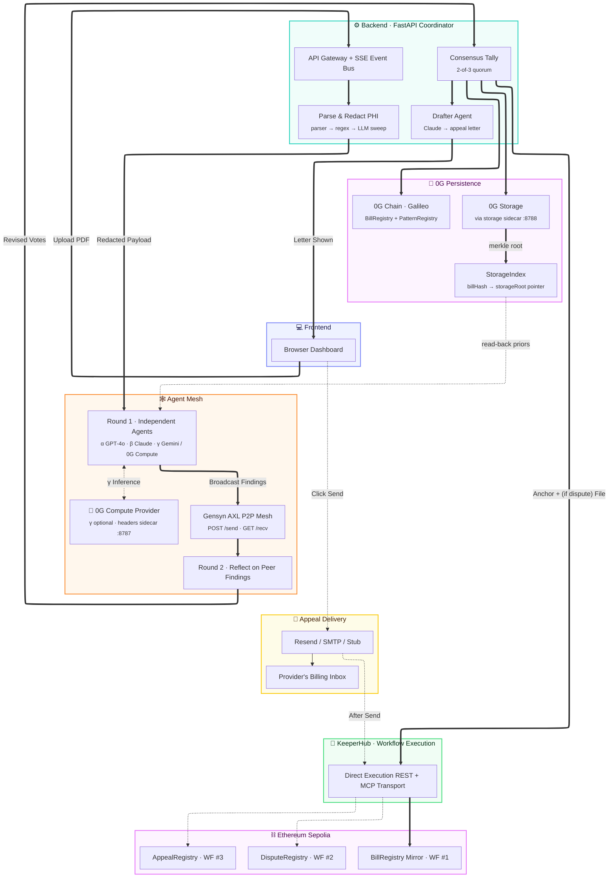

<div align="center">


<h4><sub><i>Lethe</i> &nbsp;·&nbsp; <code>/ˈliː.θi/</code> &nbsp;·&nbsp; LEE-thee &nbsp;·&nbsp; the river of forgetfulness in Greek mythology</sub></h4>

<h3>Medical bills, audited by AI consensus.<br/>Forgotten by design.</h3>

<p>
  Your bill is parsed and redacted locally. The AI never sees your PHI.<br/>
  Three independent agents vote on the redacted payload over a real Gensyn AXL mesh. Anything they agree is wrong is drafted into an appeal.<br/>
  The original bill is held in coordinator memory only — never written to disk, never persisted on-chain.
</p>

<p>
  <a href="./SETUP.md"></a>
  <a href="./whitepaper.pdf"></a>
  <a href="https://github.com/jhatch3/lethe-"></a>
</p>

<p>
  
  
  
  
  
  
</p>

<br />


</div>

<br />

---

## 📑 Table of contents

- [🩺 The problem](#-the-problem)
- [✨ What Lethe does](#-what-lethe-does)
- [🏗️ Architecture](#%EF%B8%8F-architecture)
- [🎯 Features](#-features-as-of-april-27-2026)
- [🛠️ Built with](#%EF%B8%8F-built-with)
- [⛓️ On-chain artifacts](#%EF%B8%8F-on-chain-artifacts)
- [🏆 Hackathon tracks](#-hackathon-tracks)
- [🎬 Demo](#-demo)
- [📁 Repository structure](#-repository-structure)
- [👥 Team](#-team)
- [🙏 Acknowledgments](#-acknowledgments)
- [📄 License](#-license)

> Setup, env vars, and verification: **[SETUP.md](./SETUP.md)**.

---

## 🩺 The problem

<table>
<tr>
<td width="33%" valign="top">

### 80% of bills overcharge
Surveys consistently find that the majority of itemized hospital bills contain at least one error in the patient's disfavor: duplicated codes, wrong modifiers, services that never happened.

</td>
<td width="33%" valign="top">

### Disputing is brutal
The standard process means hours on the phone, navigating insurer portals, drafting appeal letters, and waiting weeks for a response. Most patients never start.

</td>
<td width="33%" valign="top">

### The few tools that exist store everything
Existing services upload your records to a central database and keep them indefinitely. That's the opposite of what a HIPAA-anxious patient wants.

</td>
</tr>
</table>

---

## ✨ What Lethe does

Drop in a medical bill. A deterministic PDF parser extracts the structured data (CPT/ICD codes, modifiers, charges, dates of service) and a redaction pass strips every piece of PHI (patient name, DOB, address, MRN, account numbers) — *before any AI ever sees the payload*. Three independent AI agents (GPT-4o, Claude Sonnet, Gemini Flash) analyze the bill in parallel; one of them can optionally run on a **decentralized inference node** instead of a closed model API. They **broadcast their own findings** over a [Gensyn AXL](https://blog.gensyn.ai/introducing-axl/) peer-to-peer mesh and run a **round-2 reflection** with their peers' findings as new context — so each agent gets a chance to revise its vote in light of what the other two saw. A finding only enters the final result if at least 2 of 3 agents agree after that reflection round. A fourth agent (Claude) drafts a formal appeal letter from the agreed-on findings.

The original bill never touches storage and never reaches a model provider. It lives in coordinator memory long enough for the parser and redactor to run, then it's discarded. What persists is a SHA-256 + verdict anchored to [0G Galileo](https://0g.ai) (canonical proof of *what was analyzed*), the same record mirrored to Ethereum Sepolia via [KeeperHub](https://keeperhub.com), the full anonymized audit blob written to **0G Storage** with merkle root + commitment tx in the receipt, and an anonymized pattern record on `PatternRegistry` that makes the next user's analysis smarter without anyone's records being recoverable.

When consensus lands on `dispute`, KeeperHub fires a **second** workflow recording the disputed bill on a separate Sepolia `DisputeRegistry`. When the user types a provider's email and clicks **Send**, the coordinator dispatches a formatted appeal letter (with full chain verification) to the provider via a transactional email service, then KeeperHub fires a **third** workflow recording the send on-chain (recipient address keccak-hashed, never plaintext). Three KeeperHub workflows, three independent on-chain records — one immutable audit trail per bill.

---

## 🏗️ Architecture




> 📐 **Setup, env vars, and verification commands** are in [`SETUP.md`](./SETUP.md).

---

## 🎯 Features (as of April 28, 2026)

<table>
<tr>
<td width="50%" valign="top">

### 🔒 Zero retention, zero PHI exposure
A deterministic parser handles PDFs (with image fallback) inside the coordinator. PHI is then stripped by a regex pass plus an LLM redactor sweep, all *before any audit agent sees the payload*. Bill bytes are zeroed from memory immediately after the parse stage; only the redacted payload travels further. SSE events carry only stage names, verdicts, and counts — no bill content.

</td>
<td width="50%" valign="top">

### 🤖 3-agent independent consensus
GPT-4o (α), Claude Sonnet 4.5 (β), and Gemini Flash (γ) each independently analyze the redacted payload — no shared scratchpad, no orchestrator nudge. The verdict is the majority vote; a finding only survives with ≥2-of-3 quorum on the canonical billing code. When no verdict reaches majority (a 1-1-1 split), the system falls back to **clarify** rather than letting registration order silently pick a winner. Confidence is the mean across the winning side.

</td>
</tr>
<tr>
<td width="50%" valign="top">

### 🕸️ Real Gensyn AXL P2P mesh + live message log
Each of the three agents has its own AXL sidecar Docker container running the upstream Gensyn `node` binary with a unique ed25519 peer ID, joined to the public Gensyn mesh via two TLS bootstrap peers. Real `POST /send` broadcasts and real `GET /recv` inbox drains carry findings across the Yggdrasil overlay. The `/axl` page shows live topology with verified peer keys *plus a live message log* — every send/recv with sender/receiver pubkeys, byte counts, latency, and verified-ok badge. If AXL ever falls back to in-process `asyncio.gather`, a loud uvicorn startup banner makes it impossible to miss.

</td>
<td width="50%" valign="top">

### ⛓️ Three pillars on 0G — Chain + Storage + Compute
Every audit hits the full 0G stack: **0G Chain** anchors the SHA-256 + verdict to `BillRegistry` (Galileo, chain 16602) and indexes anonymized findings to `PatternRegistry`. **0G Storage** holds the full schema-versioned audit blob (more detail than chain bytes32 fields can carry), with merkle root + commitment tx in the receipt. **0G Compute** *(optional)* runs agent γ on decentralized inference via the broker SDK, with per-request signed headers handled transparently by a local Node sidecar. Built-in stub-fallback at every layer.

</td>
</tr>
<tr>
<td width="50%" valign="top">

### 🧠 Read-back pattern loop
Before each new audit, the coordinator queries `eth_getLogs` on the `PatternRegistry` and formats prior dispute / clarify rates per code into the agents' system prompts. The next run's reasoning shifts based on what previous runs found. A pre-seed script (`data-gen/scripts/seed_patterns.py`) bootstraps ~20 historical patterns so the very first demo audit shows real on-chain priors firing.

</td>
<td width="50%" valign="top">

### ✍️ Auto-drafted appeal letter
A fourth agent (Claude, separately prompted) takes the consensus findings and writes a formal, citation-bearing appeal letter. The dashboard renders it as an ASCII-bordered receipt PDF you can review and download — Lethe never auto-submits anything to an insurer.

</td>
</tr>
<tr>
<td width="50%" valign="top">

### 🔁 Round-2 reflection — consensus through conversation
The three agents don't just vote in isolation — they **talk**. Round 1 runs independent LLM calls in parallel. AXL exchange broadcasts each agent's findings to peers via its sidecar. Round 2 runs a *second* LLM call per agent with peers' findings injected — agents add findings they missed, downgrade ones peers convinced them were wrong, or hold their ground. The dashboard streams a one-line summary per agent: `α: approve → dispute · findings 1→3 · conf 0.92`. Consensus runs on round-2 votes — every finding survived peer scrutiny *and* a 2-of-3 majority.

</td>
<td width="50%" valign="top">

### 💚 KeeperHub — three distinct workflows
Every audit fires KH **twice** (mirror anchor + dispute filing on `dispute`) and a **third** time when the user clicks "Send appeal" (appeal-sent attestation). Different contracts, different methods, different gates — KH is doing real workflow orchestration. Both REST and MCP transports implemented; "already anchored" duplicates are detected and the receipt links the original tx via Sepolia event lookup, not "pending".

</td>
</tr>
<tr>
<td width="50%" valign="top">

### 🏥 Insurance payer submission
Once consensus lands on `dispute`, a panel on the dashboard lets the patient file the same disputed-codes packet directly with the insurance payer or clearinghouse. `POST /api/payer/submit` builds an X12 837 / FHIR Claim payload from the consensus findings + member info and dispatches through a pluggable adapter table. Five adapters are registered today: **stub** (default — generates a deterministic mock claim id and returns success, so the full flow is demoable end-to-end without sandbox creds), **stedi** (X12 837 over Stedi REST), **availity** (Availity FHIR R4 + Web Services), **change healthcare** (clearinghouse SOAP/REST), and **fhir** (direct payer FHIR endpoint). The adapter is selected by `LETHE_PAYER_ADAPTER` and the dashboard surfaces `live submission` vs `stub mode` in the response. Member ID, plan ID, and DOB are passed through to the adapter and never persisted.

</td>
<td width="50%" valign="top">

### 🩺 On-chain provider reputation
Each audit's NPI is extracted from the bill, salted-SHA-256 hashed, and written to a deployed `ProviderReputation` contract. Anyone can hit `/providers/<npi>` to see that provider's running stats — total audits, dispute rate, total flagged dollars — read directly from chain. The aggregate is keyed by NPI hash so individual bills aren't linkable, but a provider's overall pattern is. The page also links straight to the chainscan address for the reputation registry so the count is independently verifiable.

</td>
</tr>
<tr>
<td width="50%" valign="top">

### 📜 Versioned NCCI rulebook on chain
Coding rules (CPT bundling pairs, modifier-required pairings, units-per-day caps, time-overlap conflicts) live in a deployed `NCCIRulebook` contract with **versioned** publish-bumps so an upgrade is a single tx, not a redeploy. The `/rules` page reads the active version's rule set live from chain. The agents pull this rulebook into their priors so all three start from the same authoritative reference, and changes propagate without redeploying the coordinator.

</td>
<td width="50%" valign="top">

### 👛 Wallet connect + per-wallet audit history
Connect MetaMask (or any EIP-1193 wallet) and the dashboard remembers the audits you ran. `/my-audits` lists every bill SHA, verdict, and chain tx the connected wallet has produced — pulled from local storage, scoped per wallet address, never sent to a server. Switch wallets and the list rescopes. The wallet itself isn't required to run an audit; it's strictly an opt-in personal index so you can find your prior receipts later.

</td>
</tr>
</table>

---

## 🛠️ Built with

<div align="center">

<table>
<tr>
<td align="center" width="16%"><br/><sub><b>Next.js 16</b></sub></td>
<td align="center" width="16%"><br/><sub><b>React 19</b></sub></td>
<td align="center" width="16%"><br/><sub><b>TypeScript</b></sub></td>
<td align="center" width="16%"><br/><sub><b>Tailwind v4</b></sub></td>
<td align="center" width="16%"><br/><sub><b>Framer Motion</b></sub></td>
<td align="center" width="16%"><br/><sub><b>jsPDF</b></sub></td>
</tr>
<tr>
<td align="center"><br/><sub><b>Python 3.11</b></sub></td>
<td align="center"><br/><sub><b>FastAPI</b></sub></td>
<td align="center"><br/><sub><b>pdfplumber</b></sub></td>
<td align="center"><br/><sub><b>httpx</b></sub></td>
<td align="center"><br/><sub><b>Docker Compose</b></sub></td>
<td align="center"><br/><sub><b>GitHub</b></sub></td>
</tr>
<tr>
<td align="center"><br/><sub><b>Solidity</b></sub></td>
<td align="center"><br/><sub><b>web3.py</b></sub></td>
<td align="center"><br/><sub><b>GPT-4o</b></sub></td>
<td align="center"><br/><sub><b>Claude</b></sub></td>
<td align="center"><br/><sub><b>Gemini</b></sub></td>
<td align="center"><br/><sub><b>Gensyn AXL (Go)</b></sub></td>
</tr>
<tr>
<td align="center"><br/><sub><b>0G Chain</b></sub></td>
<td align="center"><br/><sub><b>0G Storage<br/><sup>@0glabs/0g-ts-sdk</sup></b></sub></td>
<td align="center"><br/><sub><b>0G Compute<br/><sup>@0glabs/0g-serving-broker</sup></b></sub></td>
<td align="center"><br/><sub><b>KeeperHub<br/><sup>REST + MCP</sup></b></sub></td>
<td align="center"><br/><sub><b>mcp (Python)</b></sub></td>
<td align="center"><br/><sub><b>Node sidecars<br/><sup>tsx + ethers v6</sup></b></sub></td>
</tr>
</table>

<sub>Frontend · Coordinator · Chain & AI · 0G stack · Cross-chain execution</sub>

</div>

---

## ⛓️ On-chain artifacts

Every Lethe audit produces records on two independent blockchains. Anyone with a bill's SHA-256 can verify the audit from either explorer using just the public address.

| Contract | Network | Address | Explorer |
|----------|---------|---------|----------|
| `BillRegistry` (canonical anchor) | 0G Galileo testnet (chain id 16602) | `0xf6B4C9CA2e8C8a3CE2DE77baa119004d6B51B457` | [chainscan-galileo.0g.ai](https://chainscan-galileo.0g.ai/address/0xf6B4C9CA2e8C8a3CE2DE77baa119004d6B51B457) |
| `PatternRegistry` (priors index) | 0G Galileo testnet | `0x7665c9692b1c4e6ef90495a584288604b735e23f` | [chainscan-galileo.0g.ai](https://chainscan-galileo.0g.ai/address/0x7665c9692b1c4e6ef90495a584288604b735e23f) |
| `BillRegistry` (Sepolia mirror) | Ethereum Sepolia | `0xf6B4C9CA2e8C8a3CE2DE77baa119004d6B51B457` | [sepolia.etherscan.io](https://sepolia.etherscan.io/address/0xf6B4C9CA2e8C8a3CE2DE77baa119004d6B51B457) |
| `DisputeRegistry` (KH workflow #2 target) | Ethereum Sepolia | `0xbdb8282aCD9b542b8302d872Fb9BD28B0b5e5290` | [sepolia.etherscan.io](https://sepolia.etherscan.io/address/0xbdb8282aCD9b542b8302d872Fb9BD28B0b5e5290) |
| `AppealRegistry` (KH workflow #3 target) | Ethereum Sepolia | `0x69166ACC4718a0062540673F5Cae26997BaB064e` | [sepolia.etherscan.io](https://sepolia.etherscan.io/address/0x69166ACC4718a0062540673F5Cae26997BaB064e) |
| `StorageIndex` (0G Storage pointer) | 0G Galileo testnet | `0xc435991e2aC242E7692f88c5cD78741B6dD5E614` | [chainscan-galileo.0g.ai](https://chainscan-galileo.0g.ai/address/0xc435991e2aC242E7692f88c5cD78741B6dD5E614) |
| `ProviderReputation` (NPI-hashed audit history) | 0G Galileo testnet | `0xef66dA1Ca3476F868B94E53EACbbc3FA843be8d1` | [chainscan-galileo.0g.ai](https://chainscan-galileo.0g.ai/address/0xef66dA1Ca3476F868B94E53EACbbc3FA843be8d1) |
| `NCCIRulebook` (versioned coding rules) | 0G Galileo testnet | `0xF062969fe7828277Cf27895848213742e2bA9b34` | [chainscan-galileo.0g.ai](https://chainscan-galileo.0g.ai/address/0xF062969fe7828277Cf27895848213742e2bA9b34) |

In addition, every audit's full anonymized record is uploaded to **0G Storage** with a merkle root + commitment tx, and the `(billHash → storageRoot)` pointer is recorded on `StorageIndex` so future audits can pull blobs back as **richer agent priors** (full code strings, voter agent names — vs the truncated bytes32 fields in `PatternRegistry` events). The Storage layer is genuinely bidirectional: agents both write to it and read from it.

Solidity sources: [`BillRegistry.sol`](./src/contracts/src/BillRegistry.sol), [`PatternRegistry.sol`](./src/contracts/src/PatternRegistry.sol), [`DisputeRegistry.sol`](./src/contracts/src/DisputeRegistry.sol), [`AppealRegistry.sol`](./src/contracts/src/AppealRegistry.sol), [`StorageIndex.sol`](./src/contracts/src/StorageIndex.sol), [`ProviderReputation.sol`](./src/contracts/src/ProviderReputation.sol), [`NCCIRulebook.sol`](./src/contracts/src/NCCIRulebook.sol). Deploy script (`py-solc-x` + `web3.py`, no Foundry): [`src/contracts/deploy.py`](./src/contracts/deploy.py).

---

## 🏆 Hackathon tracks

> Submitted to all three sponsor tracks at [ETHGlobal OpenAgents](https://ethglobal.com/events/openagents). Each track maps to a load-bearing piece of the system, with verifiable on-chain or open-source artifacts.

### 🎖️ Track 1 — Gensyn AXL · Best Application of AXL

**How we use AXL:** Each of the three audit agents has its own AXL sidecar Docker container running the upstream Gensyn `node` binary with a unique ed25519 keypair, joined to the public Gensyn mesh via two TLS bootstrap peers. Agents exchange findings between rounds via real `POST /send` broadcasts and `GET /recv` inbox drains — the round-2 reflection LLM call literally cannot fire without findings arriving across the mesh. The frontend `/axl` page renders **live topology** plus a 200-entry message log (every send/recv with bytes, latency, and signed pubkey pair).

**Cross-node communication proof:**
- Three separate Docker services in [`docker-compose.yml`](./docker-compose.yml) — `axl-alpha`, `axl-beta`, `axl-gamma`
- Three real ed25519 peer IDs in [`infra/axl/keys/peer_ids.json`](./infra/axl/keys/peer_ids.json) (raw 32-byte ed25519 pubkeys derived from PKCS#8 keys, not fabricated strings)
- Live verification at `/axl` shows each sidecar's `/topology` response with verified pubkeys and connections to public Gensyn peers
- No central message broker — `POST /send` from agent X's sidecar to agent Y's sidecar over the encrypted Yggdrasil overlay

**Code:** [`agents/transport_axl.py`](./src/coordinator/agents/transport_axl.py) (HTTP client + 200-entry message ring buffer), [`pipeline/runner.py`](./src/coordinator/pipeline/runner.py) (`_exchange()` and `_reflect_all()` stages), [`infra/axl/`](./infra/axl/) (Dockerfile + per-peer configs).

---

### 🛠️ Track 2 — 0G · Best Autonomous Agents, Swarms & iNFT Innovations

**How we use 0G — three pillars:** Lethe is a 3-agent swarm (GPT-4o · Claude · Gemini) that uses **the entire 0G stack**:

- **0G Chain.** `BillRegistry` anchors SHA-256 + verdict for every audited bill. `PatternRegistry` indexes anonymized findings (canonical code · action · severity · amount · voters) as on-chain events. The coordinator reads these back via `eth_getLogs` (cached 120s) and feeds aggregate dispute/clarify rates into agent prompts as priors. **Each new audit gets smarter via on-chain shared memory.**
- **0G Storage — bidirectional.** Every audit's full anonymized record is uploaded as a JSON blob via `@0glabs/0g-ts-sdk` (through a local Node sidecar) — returns a merkle root + on-chain commitment tx. The `(billHash → storageRoot)` pointer is *also* written to a deployed `StorageIndex` contract on Galileo, so future audits query `eth_getLogs` for recent roots and pull blobs back via the sidecar's `GET /download?root=R` endpoint. **The agents read priors from Storage** when blobs are available (full code strings + voter agent names) — strictly richer than the `bytes32`-truncated `PatternRegistry` events. Storage isn't cold archive; it's the primary memory layer.
- **0G Compute.** Agent γ can run on a **decentralized inference node** instead of Google Gemini. The coordinator routes through a Node sidecar that signs each request body hash via the broker SDK — 0G Compute auth is per-request, not a static bearer token. The factory probes the sidecar at startup and silently falls back to Gemini if unreachable, so `/api/status` always honestly reports γ's actual provider.

**Swarm coordination:**
- Three independent LLM agents reason in parallel during round 1 (different SDKs, different keys, different system prompts).
- Findings broadcast over Gensyn AXL (see Track 1).
- Round-2 reflection per agent with peer findings as context — agents may revise verdict, add findings, downgrade contested ones.
- 2-of-3 quorum on canonical billing code; 1-1-1 splits resolve to "clarify" (no silent registration-order tiebreak).

**Code:** [`chain/zerog.py`](./src/coordinator/chain/zerog.py) (anchor writes), [`chain/zerog_storage.py`](./src/coordinator/chain/zerog_storage.py) (PatternRegistry indexer), [`chain/zerog_blob.py`](./src/coordinator/chain/zerog_blob.py) (0G Storage uploader · 4 KB padding · circuit breaker), [`chain/storage_priors.py`](./src/coordinator/chain/storage_priors.py) (StorageIndex pointer write + read-back loop), [`chain/patterns.py`](./src/coordinator/chain/patterns.py) (chain-event priors fallback), [`agents/audit_0g.py`](./src/coordinator/agents/audit_0g.py) (γ on 0G Compute), [`agents/audit_google.py`](./src/coordinator/agents/audit_google.py) (γ factory · auto-fallback to Gemini), [`scripts/storage_sidecar.ts`](./src/coordinator/scripts/storage_sidecar.ts) and [`scripts/headers_sidecar.ts`](./src/coordinator/scripts/headers_sidecar.ts) (Node bridges to 0G TS SDKs).

---

### 💚 Track 3 — KeeperHub · Best Innovative Use of KeeperHub

**How we use KeeperHub — three distinct workflows.** KeeperHub is the execution platform that turns one consensus into multiple chain-verifiable side effects:

1. **Sepolia mirror anchor (every audit).** KH Direct Execution writes the SHA-256 + verdict to a Sepolia `BillRegistry` mirror via `POST /api/execute/contract-call`. Same record as 0G Galileo, two independent chains. Already-anchored duplicates are detected and the receipt links the original tx via Sepolia event lookup, not "pending".
2. **Dispute auto-file (consensus = `dispute`).** A second KH execution fires against [`DisputeRegistry`](https://sepolia.etherscan.io/address/0xbdb8282aCD9b542b8302d872Fb9BD28B0b5e5290), calling `recordDispute(billHash, reason, note)` with a redacted findings summary. Different contract, different method, different verdict gate.
3. **Appeal-sent attestation (user click).** When the user types a provider email and clicks **Send appeal**, the coordinator emails the appeal letter + chain verification table, then a third KH execution fires against [`AppealRegistry`](https://sepolia.etherscan.io/address/0x69166ACC4718a0062540673F5Cae26997BaB064e), calling `recordAppealSent(billHash, recipientHash)`. Recipient address is keccak-hashed before going on-chain.

**Two integration vectors implemented:**
- **Direct Execution REST API** (default for all three workflows)
- **MCP server transport** — `LETHE_KEEPERHUB_USE_MCP=true` switches the mirror anchor through KeeperHub's MCP server using the official `mcp` Python SDK. Falls back to REST if MCP returns a stub. The prize text reads "MCP server or CLI"; this satisfies the strict reading.

**Code:** [`chain/keeperhub.py`](./src/coordinator/chain/keeperhub.py) (REST integration for all three workflows), [`chain/keeperhub_mcp.py`](./src/coordinator/chain/keeperhub_mcp.py) (MCP transport), [`routers/appeal.py`](./src/coordinator/routers/appeal.py) + [`email_delivery/`](./src/coordinator/email_delivery/) (the appeal-send pipeline).

---

## 🎬 Demo

| | |
|---|---|
| 🎥 **Demo video** | [Watch on YouTube →](#) |
| 🌐 **Live demo** | [lethe-demo.vercel.app](#) |
| 📜 **Pitch deck** | [View slides →](#) |
| 📐 **Setup & verification** | [SETUP.md](./SETUP.md) |

<div align="center">
  
  
  <br />
  
  
</div>

---

## 📁 Repository structure

```
lethe-/
├── src/
│   ├── frontend/              # Next.js 16 dashboard (App Router, TS, Tailwind v4)
│   │   └── src/app/{dashboard,axl,patterns,verify,my-audits,providers/[npi],rules,tech-stack}/page.tsx
│   ├── coordinator/           # FastAPI orchestrator
│   │   ├── main.py            # app entry + CORS + sweeper + AXL-off startup banner
│   │   ├── routers/           # jobs · samples · status · verify · appeal · providers · rules · payer
│   │   ├── pipeline/          # runner, parser, redactor, consensus, dispute drafter
│   │   ├── agents/            # audit_{openai,anthropic,google,0g}, drafter, transport_axl, prompts
│   │   ├── chain/             # zerog (anchor) · zerog_storage (PatternRegistry) · zerog_blob (0G Storage)
│   │   │                      # storage_priors (StorageIndex) · patterns (chain priors)
│   │   │                      # provider_reputation (NPI-hashed stats) · ncci_rulebook (versioned rules)
│   │   │                      # keeperhub (REST · 3 workflows) · keeperhub_mcp (MCP transport)
│   │   ├── payer/             # X12 837 / FHIR adapter dispatch — stub · stedi · availity · ch · fhir
│   │   ├── email_delivery/    # sender (resend / smtp / stub) + HTML template builder
│   │   ├── scripts/           # Node helpers — provision:0g · headers:0g · storage:0g · check:0g
│   │   ├── samples/           # example bills used by the dashboard chips
│   │   └── store/             # in-memory job store + sweeper, rolling stats
│   └── contracts/             # BillRegistry · PatternRegistry · DisputeRegistry · AppealRegistry
│                              # StorageIndex · ProviderReputation · NCCIRulebook
│                              # deployed via deploy.py (py-solc-x + web3.py, no Foundry)
├── infra/
│   └── axl/                   # Dockerfile, configs/{alpha,beta,gamma}.json, keys/peer_ids.json
├── data-gen/                  # Bill PDF generator + PatternRegistry pre-seed script
├── docker-compose.yml         # axl-alpha, axl-beta, axl-gamma, coordinator, frontend
├── SETUP.md                   # Full setup + verification guide
└── README.md
```

---

## 👥 Team

<table>
<tr>
<td align="center" width="50%">
  <br />
  <b>Justin Hatch</b><br />
  <a href="https://github.com/Justyhatch3">GitHub</a> · <a href="https://www.linkedin.com/in/justinhatch/">LinkedIn</a><br />
  <sub>Telegram <code>@your-telegram-here</code> · X <code>@your-x-here</code></sub>
</td>
<td align="center" width="50%">
  <br />
  <b>Drew Manley</b><br />
  <a href="https://github.com/drewmanley16">GitHub</a> · <a href="https://www.linkedin.com/in/drewmanley/">LinkedIn</a><br />
  <sub>Telegram <code>@your-telegram-here</code> · X <code>@your-x-here</code></sub>
  <td align="center" width="50%">
  <br />
  <b>Cameron Coleman</b><br />
  <a href="https://github.com/camcoleman">GitHub</a> · <a href="https://www.linkedin.com/in/camcoleman/">LinkedIn</a><br />
  <sub>Telegram <code>@cameroncoleman13</code> · X <code>@cam_coleman1</code></sub>
</td>
</tr>
</table>

> **Note:** Telegram + X handles are placeholders — fill in before submission. 0G's qualification requirements specifically ask for these.

---

## 🙏 Acknowledgments

<table>
<tr>
<td valign="middle" width="20%" align="center" bgcolor="#ffffff">
  <a href="https://www.oregonblockchain.org">
    
  </a>
</td>
<td valign="middle">

### [Oregon Blockchain Group](https://www.oregonblockchain.org)

Built with support from the **Oregon Blockchain Group** at the University of Oregon, a student-led organization at the heart of the Pacific Northwest blockchain ecosystem and part of the [University Blockchain Research Initiative](https://ripple.com/impact/ubri/).

[Website](https://www.oregonblockchain.org) · [LinkedIn](https://www.linkedin.com/company/oregonblockchain) · [Twitter](https://x.com/oregonblock) · [Instagram](https://www.instagram.com/oregonblockchaingroup/)

</td>
</tr>
</table>

Special thanks to the sponsors of the ETHGlobal OpenAgents tracks: [0G Labs](https://0g.ai), [Gensyn](https://www.gensyn.ai), and [KeeperHub](https://keeperhub.com), for the infrastructure that makes Lethe possible.

---

## 📄 License

[MIT](./LICENSE) © 2026. Built at [ETHGlobal OpenAgents](https://ethglobal.com/events/openagents)

<br />

<div align="center">

<sub>Lethe is a hackathon project and is not yet a production medical service.<br/>
Disputes drafted by Lethe should be reviewed by a human before submission to a real insurer.</sub>

<br /><br />

<a href="#-quick-start"><b>↑ Back to top ↑</b></a>

</div>
