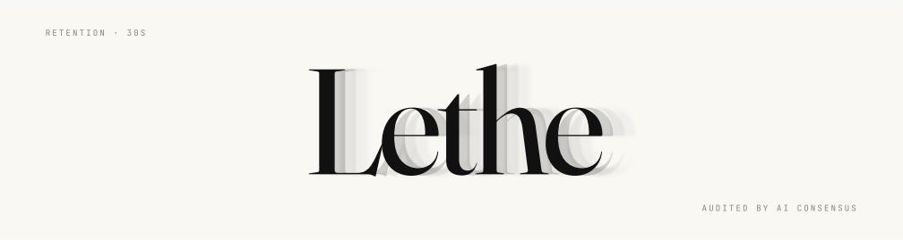
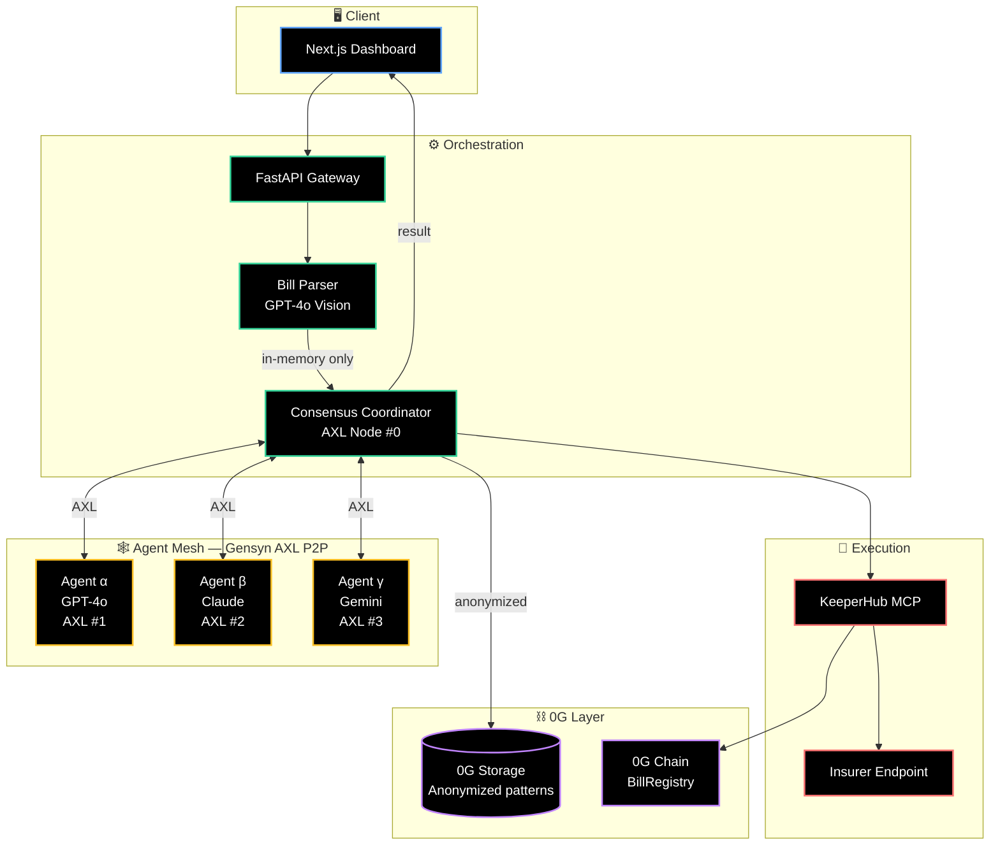
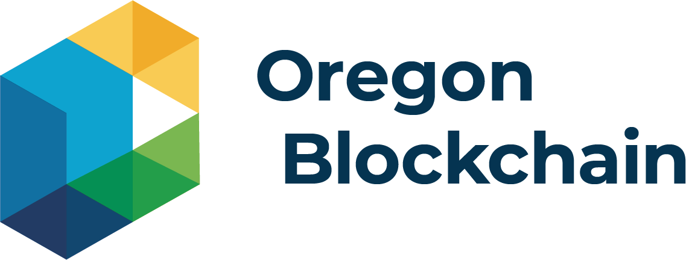

<!--
=============================================================================
   IF YOU PICK A DIFFERENT NAME THAN "Lethe":
   Find-and-replace these tokens in this file:
     - "Lethe"      → your chosen name (capitalized)
     - "lethe"      → your chosen name (lowercase, used in URLs/handles)
   Also update the hero banner image path below (./assets/banner.png).
=============================================================================
-->

<div align="center">




<h3>Medical bills, audited by AI consensus.<br/>Forgotten by design.</h3>

<p>
  Three independent AI agents review every bill. Anything they agree is wrong gets disputed automatically.<br/>
  Your records exist in memory for thirty seconds, then they're gone.
</p>

<p>
  <a href="#-quick-start"></a>
  <a href="#-demo"></a>
  <a href="https://ethglobal.com/events/openagents"></a>
</p>

<p>
  
  
  
  
  
</p>

<br />


---

## 🩺 The problem

<table>
<tr>
<td width="33%" valign="top">

### 80% of bills overcharge
Surveys consistently find that the majority of itemized hospital bills contain at least one error in the patient's disfavor — duplicated codes, wrong modifiers, services that never happened.

</td>
<td width="33%" valign="top">

### Disputing is brutal
The standard process means hours on the phone, navigating insurer portals, drafting appeal letters, and waiting weeks for a response. Most patients never start.

</td>
<td width="33%" valign="top">

### The few tools that exist store everything
Existing services upload your records to a central database and keep them indefinitely. That's the opposite of what a HIPAA-anxious patient wants.

</td>
</tr>
</table>

---

## ✨ What Lethe does

Drop in a medical bill. Three independent AI agents — running on three different model providers, communicating peer-to-peer over [Gensyn AXL](https://blog.gensyn.ai/introducing-axl/) — each analyze it for overcharges, coding errors, and dispute opportunities. They vote. If consensus emerges with sufficient confidence, Lethe auto-drafts a dispute letter and submits it on-chain via [KeeperHub](https://keeperhub.com).

The bill itself never touches storage. It lives in coordinator memory long enough for the agents to read it, then it's discarded. What persists is a SHA-256 hash anchored on [0G Chain](https://0g.ai) — proof of *what was analyzed* — and an anonymized pattern record on [0G Storage](https://docs.0g.ai) that makes the next user's analysis smarter without anyone's records being recoverable.

---

## 🏗️ Architecture



> 📐 **Full architecture, sequence diagrams, data flow, and state machine** are in [`/docs/ROADMAP.md`](./docs/ROADMAP.md).

---

## 🎯 Features

<table>
<tr>
<td width="50%" valign="top">

### 🔒 Zero retention
Your bill exists in memory for the ~30 seconds it takes agents to analyze it, then it's discarded. We never write it to disk, never store it on 0G, never log it. We can't leak what we don't have.

</td>
<td width="50%" valign="top">

### 🤖 Decentralized AI consensus
Three independent models — GPT-4o, Claude, Gemini — each analyze the bill independently. We only act when at least two agree with high confidence. No single model can be a bad actor.

</td>
</tr>
<tr>
<td width="50%" valign="top">

### 🕸️ Peer-to-peer agent communication
Agents talk to each other directly over Gensyn AXL — no central message broker we control, no server that could be compromised to manipulate consensus.

</td>
<td width="50%" valign="top">

### ⛓️ Verifiable on-chain audit
Every analysis leaves a hash and vote record on 0G Chain via KeeperHub's reliable execution layer. You hold your bill; the chain proves what was analyzed.

</td>
</tr>
<tr>
<td width="50%" valign="top">

### 🧠 Persistent learning, anonymized
Patterns ("duplicate CPT 99214 → 87% successful dispute rate") accumulate on 0G Storage and improve every future analysis — without ever holding any patient's data.

</td>
<td width="50%" valign="top">

### ✍️ Auto-drafted disputes
When consensus identifies a problem, Lethe drafts a formal appeal letter with regulatory citations and submits it on your behalf. You approve before it goes out.

</td>
</tr>
</table>

---

## 🛠️ Built with

<div align="center">

<table>
<tr>
<td align="center" width="14%"><br/><sub><b>Next.js</b></sub></td>
<td align="center" width="14%"><br/><sub><b>TypeScript</b></sub></td>
<td align="center" width="14%"><br/><sub><b>Tailwind</b></sub></td>
<td align="center" width="14%"><br/><sub><b>Framer Motion</b></sub></td>
<td align="center" width="14%"><br/><sub><b>Python</b></sub></td>
<td align="center" width="14%"><br/><sub><b>FastAPI</b></sub></td>
<td align="center" width="14%"><br/><sub><b>Docker</b></sub></td>
</tr>
<tr>
<td align="center"><br/><sub><b>Solidity</b></sub></td>
<td align="center"><br/><sub><b>EVM / 0G</b></sub></td>
<td align="center"><br/><sub><b>GPT-4o</b></sub></td>
<td align="center"><br/><sub><b>Claude</b></sub></td>
<td align="center"><br/><sub><b>Gemini</b></sub></td>
<td align="center"><br/><sub><b>GitHub</b></sub></td>
<td align="center"><br/><sub><b>Vercel</b></sub></td>
</tr>
</table>

</div>

---

## 🏆 Hackathon Tracks

Built for [ETHGlobal OpenAgents](https://ethglobal.com/events/openagents), April 24 – May 3, 2026.

<table>
<tr>
<td width="33%" valign="top" align="center">

### [0G](https://0g.ai)
**The blockchain for AI agents**

Lethe uses **0G Chain** for the bill registry contracts and **0G Storage** for the anonymized agent memory layer. Our pitch: *ephemeral PHI, persistent learning* — we use 0G to make agents smarter without ever holding patient data.

</td>
<td width="33%" valign="top" align="center">

### [Gensyn AXL](https://blog.gensyn.ai/introducing-axl/)
**Peer-to-peer agent communication**

Each of our agents runs in its own container with its own AXL node and ed25519 peer ID. Consensus is reached without a central message broker — pure P2P, demonstrated across separate machines.

</td>
<td width="33%" valign="top" align="center">

### [KeeperHub](https://keeperhub.com)
**Reliable onchain execution**

Every dispute submission, registry write, and vote anchor goes through KeeperHub for gas optimization, retry logic, and full audit trails. Failed execution = lost consumer money, so reliability is non-negotiable.

</td>
</tr>
</table>

---

## 🚀 Quick start

### Prerequisites

- Docker & Docker Compose
- Node.js 20+
- Python 3.11+
- A 0G Galileo testnet wallet (faucet: [docs.0g.ai](https://docs.0g.ai))
- API keys: `OPENAI_API_KEY`, `ANTHROPIC_API_KEY`, `GOOGLE_API_KEY`
- KeeperHub account ([keeperhub.com](https://keeperhub.com))

### Run it

```bash
# Clone
git clone https://github.com/your-org/lethe.git
cd lethe

# Configure
cp .env.example .env
# Fill in API keys, RPC URL, contract addresses

# Build & start the full stack
docker compose up --build

# Open the dashboard
open http://localhost:3000
```

The compose file spins up:
- `coordinator` — FastAPI orchestrator + AXL node #0
- `agent-alpha`, `agent-beta`, `agent-gamma` — three agent containers, each with its own AXL node
- `frontend` — Next.js dashboard
- `insurer-stub` — simulated insurance endpoint for demo

### Try it

1. Drop a sample bill from `/samples/` onto the upload zone
2. Watch the three agents vote in real time over the AXL mesh
3. See the consensus decision, on-chain transaction hash, and drafted dispute letter

---

## 🎬 Demo

| | |
|---|---|
| 🎥 **Demo video** | [Watch on YouTube →](#) |
| 🌐 **Live demo** | [lethe-demo.vercel.app](#) |
| 📜 **Pitch deck** | [View slides →](#) |
| 📐 **Architecture deep-dive** | [/docs/ROADMAP.md](./docs/ROADMAP.md) |

<!-- Replace these screenshots with real ones from the dashboard -->
<div align="center">
  
  
  <br />
  
  
</div>

---

## 📁 Repository structure

```
lethe/
├── frontend/              # Next.js dashboard
├── coordinator/           # FastAPI orchestrator + AXL node #0
├── agent/                 # Agent template (cloned per LLM provider)
│   ├── alpha/             # GPT-4o agent + AXL node #1
│   ├── beta/              # Claude agent  + AXL node #2
│   └── gamma/             # Gemini agent  + AXL node #3
├── assets/                # Static images (README banner, etc.)
├── contracts/             # Foundry project — BillRegistry, ConsensusVote
├── infra/                 # docker-compose, AXL configs, KeeperHub workflows
├── samples/               # Anonymized example bills for demo
├── docs/
│   ├── ROADMAP.md         # Full architecture & build plan
│   └── PRIVACY.md         # Zero-retention threat model
└── README.md
```

---

## 👥 Team

<table>
<tr>
<td align="center" width="25%">
  <br />
  <b>Justin Hatch</b><br />
  <a href="https://github.com/jhatch3">GitHub</a> · <a href="https://www.linkedin.com/in/justinhatch/">LinkedIn</a>
</td>
<td align="center" width="25%">
  <br />
  <b>[Name]</b><br />
  <sub>Chain / Execution</sub><br />
  <a href="#">GitHub</a> · <a href="#">LinkedIn</a>
</td>
<td align="center" width="25%">
  <br />
  <b>[Name]</b><br />
  <sub>P2P / DevOps</sub><br />
  <a href="#">GitHub</a> · <a href="#">LinkedIn</a>
</td>
<td align="center" width="25%">
  <br />
  <b>[Name]</b><br />
  <sub>Frontend / UX</sub><br />
  <a href="#">GitHub</a> · <a href="#">LinkedIn</a>
</td>
</tr>
</table>

---

## 🙏 Acknowledgments

<table>
<tr>
<td valign="middle" width="20%" align="center" bgcolor="#ffffff">
  <a href="https://www.oregonblockchain.org">
    
  </a>
</td>
<td valign="middle">

### [Oregon Blockchain Group](https://www.oregonblockchain.org)

Built with support from the **Oregon Blockchain Group** at the University of Oregon — a student-led organization at the heart of the Pacific Northwest blockchain ecosystem and part of the [University Blockchain Research Initiative](https://ripple.com/impact/ubri/).

[Website](https://www.oregonblockchain.org) · [LinkedIn](https://www.linkedin.com/company/oregonblockchain) · [Twitter](https://x.com/oregonblock) · [Instagram](https://www.instagram.com/oregonblockchaingroup/)

</td>
</tr>
</table>

Special thanks to the sponsors of the ETHGlobal OpenAgents tracks — [0G Labs](https://0g.ai), [Gensyn](https://www.gensyn.ai), and [KeeperHub](https://keeperhub.com) — for building the infrastructure that makes Lethe possible.

---

## 📄 License

[MIT](./LICENSE) © 2026 — Built at [ETHGlobal OpenAgents](https://ethglobal.com/events/openagents)

<br />

<div align="center">

<sub>Lethe is a hackathon project and is not yet a production medical service.<br/>
Disputes drafted by Lethe should be reviewed by a human before submission to a real insurer.</sub>

<br /><br />

<a href="#-quick-start"><b>↑ Back to top ↑</b></a>

</div>
