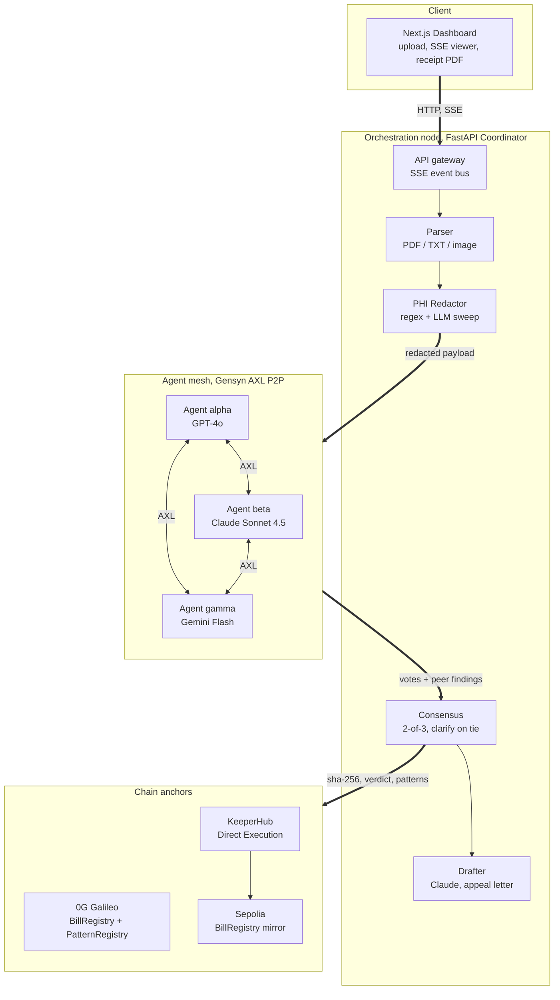
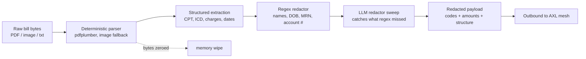
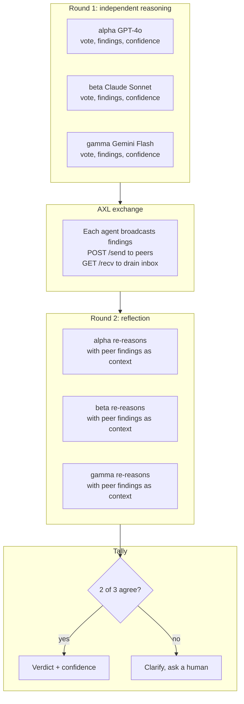
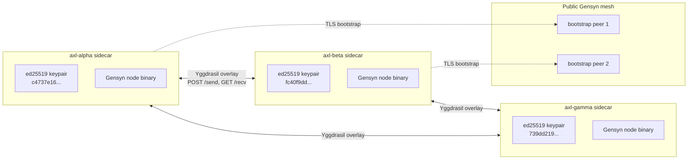
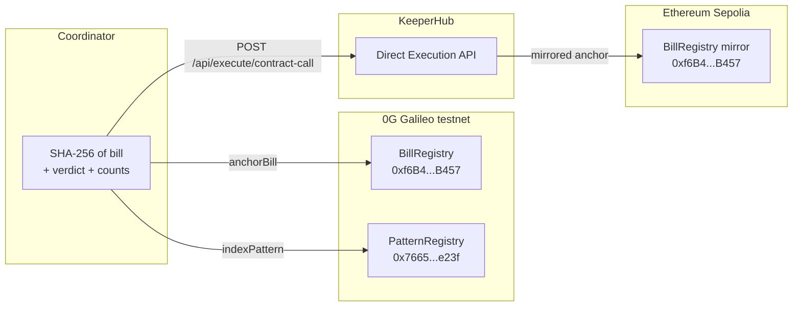
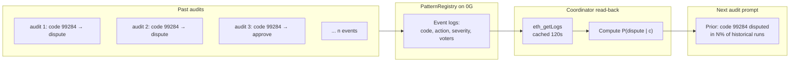

# Lethe: How Three AI Models Audit Your Medical Bill, Argue With Each Other, and Then Forget Everything

*A walk-through of multi-agent consensus, peer-to-peer agent communication, and dual-chain anchoring. And why your medical privacy depends on all three working together.*

---

## The problem

Roughly 80% of US medical bills contain at least one error. Almost all of them favor the hospital. Of the people who actually dispute, about 75% win.

Three out of four. If a casino had those odds, the line would loop the block. But most people never start, and the few software tools that exist all share the same flaw: to use them, you upload your bill. Your name, your date of birth, your account number, all sent to a server you have no real visibility into. The thing you're trying to dispute is a privacy violation in a thousand small ways, and the existing remedy is to commit a much bigger one.

We built Lethe at ETHGlobal OpenAgents to attack that catch-22 directly. The premise was simple: what if the AI never saw your name in the first place? The implementation is where it got interesting, and that's what this post is about.

---

## What Lethe does

You drop in a medical bill. A deterministic parser inside the coordinator extracts the structured data (CPT codes, ICD codes, modifiers, charges, dates of service) and a redaction pass strips every piece of personally identifiable information before any model receives the payload. Three independent AI agents then audit the redacted payload in parallel: GPT-4o, Claude Sonnet 4.5, and Gemini Flash. They broadcast their findings to each other over a peer-to-peer mesh, run a second reasoning pass with their peers' findings as context, and a finding only enters the final verdict if at least two of three still agree on it after that round. A fourth Claude pass drafts the appeal letter. The original bill never touches storage. What persists is a SHA-256 hash anchored to two independent blockchains, plus an anonymized pattern record that makes the next user's audit smarter without making any individual bill recoverable.

Lethe is the river of forgetfulness in Greek mythology. The naming is on purpose.

---

## The shape of the system

Five things in Lethe are doing real architectural work, and they're easier to understand if you see them in relation to each other before going deep on any one. Here is the system at a glance:



A bill enters the coordinator, gets parsed and redacted, leaves the coordinator only as a redacted payload, gets reasoned over by three independent agents that talk peer-to-peer over an AXL mesh, returns a consensus verdict, anchors a hash to two chains, and produces a draft appeal letter for the user. The next five sections walk through one piece each, in the order data flows through the system.

---

## Step 1: PHI redaction, before the model

The most common pattern in "private AI" tooling is to send sensitive data to a model and trust the model not to leak it. The vendor promises good logging hygiene, the model is instructed to forget, and the user is asked to take this on faith. That works fine until logs get subpoenaed, vendors get breached, or the model includes a fragment of the input in its response by accident. The data is in the model's hands. Whether it stays private is somebody else's promise.

Lethe's first design decision was to refuse that pattern. The redaction pipeline runs entirely inside the coordinator process, before any outbound call to a model provider:



The parser is deterministic by design. PDFs go through pdfplumber for native text extraction, with an image fallback for scanned documents. There is no model involved in this stage, which makes the parsing step auditable in a way an LLM-based parser would not be.

Once the structure is extracted, two redaction passes run in series. A regex sweep handles the easy cases: numeric patterns for dates and account numbers, positional cues for "Patient:" and "DOB:" labels, recognizable address formats. A second LLM-based sweep then runs on the post-regex output to catch identifiers that the regex pass missed.

After the redaction completes, the original bill bytes are explicitly zeroed from memory. They are never written to disk. They are never persisted on chain. The bill exists in coordinator memory just long enough to extract structure from it, then it stops existing. What continues onward through the rest of the pipeline is the redacted payload, which contains only what's billable: CPT codes, ICD codes, modifiers, charge amounts, dates of service, place-of-service codes. Everything that a billing auditor needs, and nothing that identifies a person.

The asymmetry here is the whole point. The AI literally cannot leak what it never received. That's not a promise about behavior; it's a property of the architecture.

---

## Step 2: Three agents, two rounds, one verdict

With the redacted payload in hand, the system fans out to three independent agents: GPT-4o (alpha), Claude Sonnet 4.5 (beta), and Gemini Flash (gamma). The audit runs in two distinct rounds with a peer-exchange step in the middle:



Round one runs each agent in complete isolation. There is no shared scratchpad. There is no orchestrator nudging anyone toward agreement. They get the same redacted input and they produce votes independently. This isolation matters: if one agent's reasoning becomes context for the second, which becomes context for the third, you stop measuring three independent assessments and start measuring how persuasive the first agent was.

Once round one finishes, each agent broadcasts its complete findings (not just its vote) to the other two over the AXL mesh. Sharing only votes would lose the most important signal, which is why a peer voted the way it did. If alpha flagged a duplicate charge that beta missed, beta needs to see alpha's reasoning to evaluate whether it's a valid catch.

Round two is where the actual consensus happens. Each agent runs a second LLM call with its peers' findings injected into the prompt as new context. They can change their vote, add a flag they missed, or hold their ground. The reflection prompt is biased explicitly against herd-voting; agents are told to update only if they actually agree on a second look, not because their peers said so. The dashboard streams a one-line summary per agent during this phase, like:

```
alpha: approve → dispute · findings 1 → 3 · conf 0.92
```

That's an agent that voted "approve" in round one, changed its mind to "dispute" after seeing peer findings, expanded its finding count from one to three, and ended at 0.92 confidence.

The tally rule applies to round-two votes only. A finding is included in the final verdict only if at least two of the three agents flagged the same canonical billing code after round two. The confidence score on that included finding is the average of the confidence scores from the agents who agreed on it.

A 1-1-1 split, where each agent voted differently, resolves to `clarify` rather than to a silently-broken tie. The system surfaces the disagreement to the user instead of pretending it reached a verdict it didn't reach. That's a small detail with a big honesty payoff.

---

## Step 3: Why the message layer has to be P2P

Round two's peer-reflection idea only works if the messages between agents in the exchange step are actually what they claim to be. If alpha's findings could be silently rewritten in transit before reaching beta, the whole reflection mechanism collapses into a more elaborate orchestrator pretending to be a peer network. The integrity of the consensus depends on the integrity of the message layer.

Lethe's agents don't share a message broker. Each agent runs as its own Docker sidecar with a unique cryptographic identity, joined to the public Gensyn AXL mesh:



Each sidecar holds a unique Ed25519 keypair stored in `infra/axl/keys/peer_ids.json`. Those public keys are the agents' identities, and they're verifiable on the live `/axl` page in the running app. Each sidecar joins the public Gensyn network through a TLS handshake to two bootstrap peers, which is what makes this a real public mesh and not a private LAN with a P2P-flavored API painted on top.

When alpha wants to broadcast its findings, the coordinator inside the alpha container POSTs to its local AXL sidecar's `/send` endpoint with a target peer key and a payload. The sidecar handles routing across the encrypted Yggdrasil overlay. Beta's sidecar receives the message and queues it in an inbox. The coordinator inside the beta container drains the inbox via `GET /recv`. Beta literally receives bytes that originated from alpha, by way of an encrypted mesh that no central party owns.

The reason this matters for medical bill auditing is the same reason it matters for any consensus system: what one agent sent has to be what the others receive. Without the cryptographic mesh underneath, the round-two reflection step loses its meaning.

---

## Step 4: Anchoring the result on two chains

When the round-two tally completes, the coordinator has three things worth preserving: a SHA-256 hash of the original bill, the verdict and confidence, and an anonymized pattern record of the findings (which canonical billing codes triggered, which actions, severity, voters). The bill itself does not need to be stored. The fingerprint and the verdict do, because they're the only way to prove later that an audit happened on this specific bill at this specific time.

That's the precise problem a blockchain anchor is good at: writing a small, non-sensitive fingerprint to a public ledger that nobody (including us) can edit after the fact. Lethe writes that fingerprint to two ledgers:



The canonical anchor goes to a `BillRegistry` contract on the 0G Galileo testnet (chain ID 16602). The same hash and verdict get mirrored to a separate `BillRegistry` on Ethereum Sepolia, written there via KeeperHub's Direct Execution API. The coordinator POSTs the contract-call request to KeeperHub and polls execution status; KeeperHub abstracts the retry logic, gas optimization, and audit trail. The execution semantics on Sepolia end up identical to a direct write, but the operational layer is somebody else's problem.

Two chains is meaningful because it's redundancy. If 0G Galileo has issues at audit time, the proof still lives on Sepolia. If Sepolia is congested, the canonical record is on 0G. They are independent infrastructure with independent failure modes. For a system that anchors *every* audit, that redundancy compounds.

What the user gets out of it is a receipt. The dashboard renders an ASCII-bordered receipt PDF with both transaction hashes embedded. The user can paste either hash into the corresponding chain explorer (`chainscan-galileo.0g.ai` or `sepolia.etherscan.io`) and verify, independently, that the audit happened. Not "trust Lethe." Verify it.

This is the part that's hardest to communicate to non-crypto readers, so let me try once more from a different angle. If you're disputing a $4,000 ER bill and the hospital pushes back with "how do we know this audit was actually run when you claim," you can hand them a transaction hash on a public ledger they can check themselves. The blockchain isn't decoration; it's the part of the system that turns "we audited it" from a claim into a proof.

---

## Step 5: A system that learns without remembering

The last piece is the most subtle, and architecturally the most interesting. Each audit produces an anonymized pattern record: a canonical billing code, an action (dispute, clarify, or approve), a severity, an amount, and how many agents voted for it. These records contain no patient identifiers, no hospital identifiers, nothing that reconstructs a single bill. They're statistical aggregate data, and they get written to a `PatternRegistry` contract on 0G Galileo as event logs.

Before each new audit starts, the coordinator queries that contract via `eth_getLogs` (cached for 120 seconds server-side) and computes priors. For each billing code, it counts how many past audits ended in a dispute or clarify for that code, divided by the total number of times the code has appeared. If code 99284 was disputed in 14 of the last 20 runs that touched it, the prior for that code is a 70% historical dispute rate. Those rates get formatted into the agents' system prompts as priors before the new run starts:



The result is that each audit's reasoning is informed by the patterns of every previous audit, but no individual bill is ever recoverable. The events on chain are aggregate statistics. The coordinator never has the source bill. The chain never had it either.

This is the part that justifies the word "decentralized" in any serious sense. The shared knowledge layer (which billing codes tend to be wrong, in what direction, with what severity) lives on a public chain that any other auditor could in principle read from and contribute to. Lethe is one client of that data layer. Memory without surveillance is the goal: anonymized patterns in, no records out. The system gets sharper every run; no individual is ever identifiable.

---

## Why all five pieces together

Each of the five steps is solving a specific failure mode that a simpler version of this system would walk straight into:

| Step | What it prevents |
|---|---|
| Local PHI redaction | Models seeing data they could leak via logs, fine-tuning artifacts, or accidental quoting |
| Independent round-one reasoning | One model's biases propagating through the whole vote |
| Real P2P message exchange | Orchestrator-mediated message tampering or filtering |
| Round-two reflection | Lazy ensembling that ignores cross-agent reasoning |
| 2-of-3 quorum with clarify on tie | Silent tie-breaks that look confident but aren't |
| Dual-chain anchoring | Single-chain failure erasing the audit trail |
| PatternRegistry read-back | A system that doesn't learn from its own history |

There is a version of this project that uses one AI model, no consensus, a centralized message bus, no chain anchor, and a regular database for the bill. That version would be smaller in code and would mostly work. It would also fail every adversarial test that matters: vendor breach, model leakage, dispute over what was actually checked, model bias on a particular billing code.

---

## Who benefits

The obvious case is patients. Get the dispute power without surrendering more privacy to get it. The bill never leaves your machine in a re-identifiable form. The receipt is verifiable by anyone with a chain explorer. The appeal letter arrives drafted.

For builders working on AI in regulated domains, Lethe is a worked example of an architecture pattern: redact-before-model, multi-agent consensus, on-chain audit trail, anonymized memory. The pattern generalizes beyond medical billing. The same shape would work for financial document review, legal document review, or any setting where you have sensitive inputs and need an auditable AI verdict.

For anyone watching the blockchain space who hasn't yet seen a use that wasn't speculation or a token launch: Lethe uses smart contracts as a tamper-evident receipt layer for AI audits and as a shared knowledge graph for billing patterns. Neither involves speculation. Both genuinely require the properties of a public ledger (immutability, public verifiability, censorship resistance) and would be worse if you tried to do them with a centralized database.

---

## Honest caveats

This is a hackathon project, not a production medical service. A few things worth calling out clearly.

The 0G contracts are deployed to the Galileo testnet, and the mirror is on Sepolia. Both are testnets. Production would mean migrating to live networks.

The drafter agent produces a formal, citation-bearing appeal letter, but the letter should be reviewed by a human before submission to a real insurer. The consensus findings are themselves probabilistic, and a confidently-wrong claim in front of an insurance reviewer is worse than no claim at all.

The architecture is auditable, but the system is hackathon-scale. Real-world deployment would require a much larger redaction test corpus, more billing-format coverage, and the operational hardening that any privacy-critical system needs before it touches real patient data.

---

## What's next

The hackathon submission is in. The repo is open at [github.com/jhatch3/lethe-](https://github.com/jhatch3/lethe-). The contracts are deployed and verifiable on the explorers linked above. The dashboard is functional and the SSE pipeline streams every stage of an audit live during a run.

If you want to try it, clone the repo, fill in the env vars per `SETUP.md`, and `docker compose up`. Sample bills under `src/coordinator/samples/` will run end-to-end without you needing to upload anything personal.

Lethe was built at ETHGlobal OpenAgents in April 2026 by Justin Hatch and Drew Manley, with support from the Oregon Blockchain Group at the University of Oregon. Thanks to 0G Labs, Gensyn, and KeeperHub for the infrastructure that makes this possible.

Built to be forgotten.

---

### Note on rendering this article for Medium

Medium does not render Mermaid diagrams natively in published posts. To publish:

1. Copy each Mermaid block into [mermaid.live](https://mermaid.live), export as PNG or SVG, and upload to Medium as an image at the corresponding spot in the article.
2. The fenced code blocks (the agent log line in Step 2) will render as code blocks in Medium with no extra work.

The article is structured to read cleanly even on platforms where the diagrams don't render, but the diagrams genuinely help the reader follow the data flow, so they're worth the extra step.
